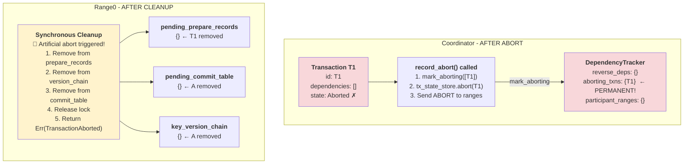

# Phase 1: T1 PREPARE with Artificial Abort

**What happened:**
1. T1 reaches PREPARE phase in Range0
2. **Artificial abort triggered** (random < abort_rate)
3. **Synchronous cleanup** (while holding lock):
   - Remove T1 from `pending_prepare_records`
   - Remove T1 from `key_version_chain[A]`
   - Remove A from `pending_commit_table`
4. Release lock
5. Return `Err(TransactionAborted)` to coordinator
6. Coordinator calls `record_abort()`:
   - **CRITICAL**: `mark_aborting([T1])`
   - T1 added to `aborting_transactions` **PERMANENTLY**
   - Send ABORT to all ranges

**Key Insight:** T1 marked in `aborting_transactions` forever. Any future `is_aborting(T1)` returns `true`.

---

