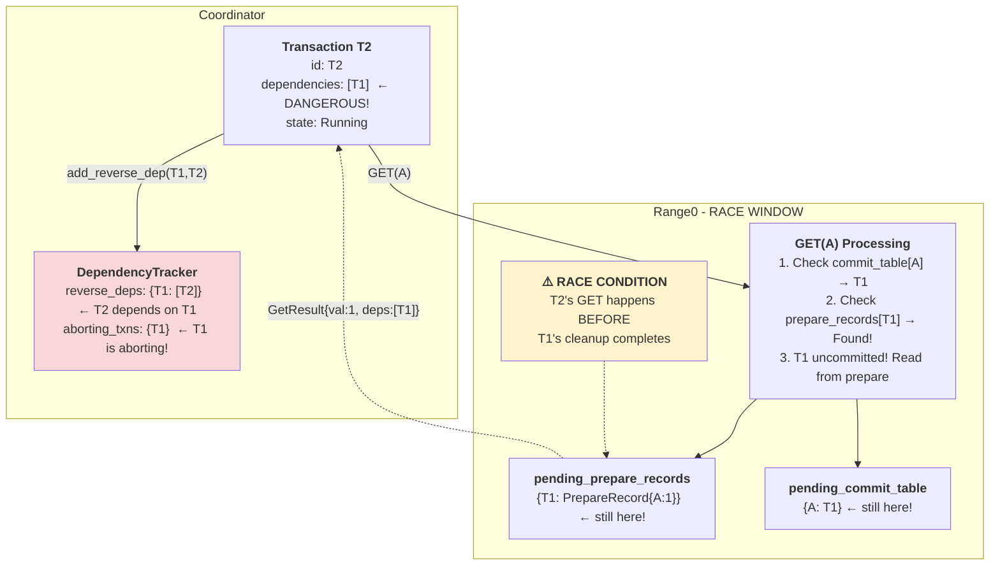

# Phase 2: T2 GET(A) - Race Condition

**What happened (race condition):**
1. T2 does GET(A) **before** T1's cleanup completes
2. Range0 finds: `pending_commit_table[A] = T1` ✓
3. Range0 finds: `pending_prepare_records[T1]` → **Still exists!**
4. Read T1's uncommitted value
5. Return: `GetResult{val: 1, dependencies: [T1]}`
6. Coordinator adds: `reverse_deps[T1] = [T2]`

**Dangerous state:**
- T2 depends on T1
- But T1 is in `aborting_transactions`!
- If T2 sent to resolver → **DEADLOCK** (waits for T1 to commit, which will never happen)

**Key Insight:** This race is why we need dependency validation before sending to resolver!

---

