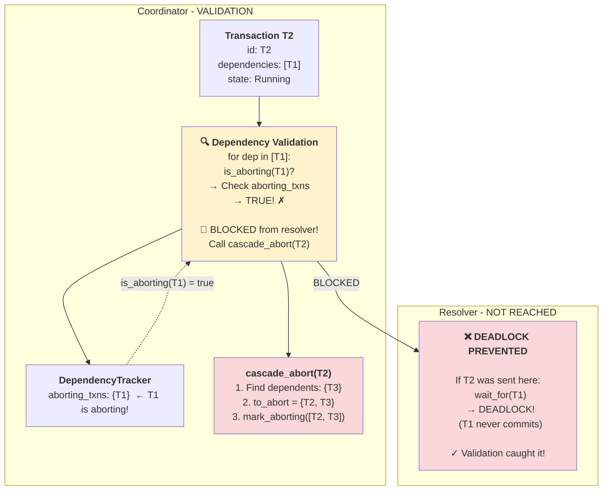

# Phase 3: T2 COMMIT - Validation Prevents Deadlock




**What happened:**
1. T2 completes PREPARE, tries to commit
2. T2 has `dependencies = [T1]` → would normally go to resolver
3. **VALIDATION CHECK** (coordinator/src/transaction.rs:597-617):
   ```rust
   for dep in dependencies {  // [T1]
       if is_aborting(dep) {  // is_aborting(T1)?
           // Check aborting_transactions set
           // → TRUE! (T1 was marked in Phase 1)
           cascade_abort(T2);
           return Err(CascadingAbort);
       }
   }
   ```
4. **T2 BLOCKED** from resolver!
5. Call `cascade_abort(T2)`

**Critical insight:**
- **Without this check**: T2 sent to resolver
- Resolver calls `wait_for(T1)` → **DEADLOCK** (T1 never commits)
- **With this check**: T2 caught early, cascade abort triggered

**This is the key fix that prevents resolver deadlock!**

---

