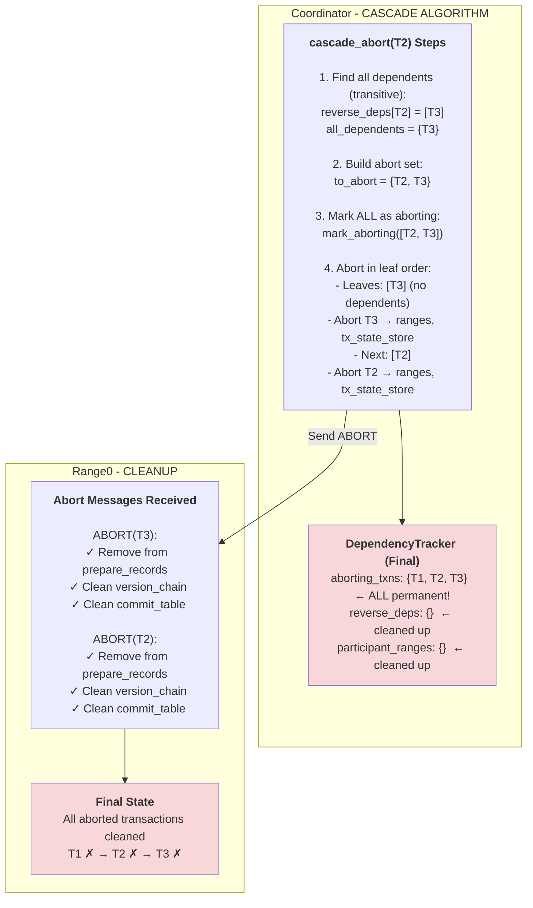

# Phase 4: Cascade Abort Propagation (T2 → T3)




**What happened (cascade_abort algorithm):**

1. **Find all dependents** (line 275-280):
   ```rust
   let all_dependents = find_all_dependents(&dependency_tracker, T2, &mut visited);
   // Searches reverse_deps transitively
   // reverse_deps[T2] = [T3]
   // Result: {T3}
   ```

2. **Build full abort set** (line 279-280):
   ```rust
   let mut to_abort = all_dependents;  // {T3}
   to_abort.insert(T2);                // {T2, T3}
   ```

3. **Mark all as aborting** (line 283-284):
   ```rust
   dependency_tracker.mark_aborting(&[T2, T3]).await;
   // aborting_transactions: {T1, T2, T3}  ← ALL permanent!
   ```

4. **Abort in leaf-to-root order** (line 286-351):
   ```rust
   while !to_abort.is_empty() {
       // Find leaves: transactions with no dependents in to_abort set
       let leaves = find_leaves(&to_abort);  // [T3]

       for tx_id in leaves {
           // Send ABORT to all ranges
           for range_id in participant_ranges[tx_id] {
               range_client.abort_transaction(tx_id, range_id).await;
           }

           // Abort in tx_state_store
           tx_state_store.try_abort_transaction(tx_id).await;

           // Clean up dependency tracker
           dependency_tracker.remove_reverse_deps(tx_id).await;
           dependency_tracker.remove_participant_ranges(tx_id).await;

           // NOTE: We do NOT unmark_aborting(tx_id)!
           // Transaction stays in aborting set FOREVER

           to_abort.remove(tx_id);
       }
       // Next iteration: to_abort = {T2}
       // T2 is now a leaf → abort T2...
   }
   ```

**Final state:**
```
DependencyTracker:
  aborting_transactions: {T1, T2, T3}  ← PERMANENT markers
  reverse_deps: {}                      ← All cleaned up
  participant_ranges: {}                ← All cleaned up

Transactions:
  T1: Aborted (artificial)
  T2: Aborted (cascading)
  T3: Aborted (cascading)
```

**Key Insight:** Leaf-to-root order ensures dependencies are aborted before dependents. `aborting_transactions` set is permanent - never cleared.

---

