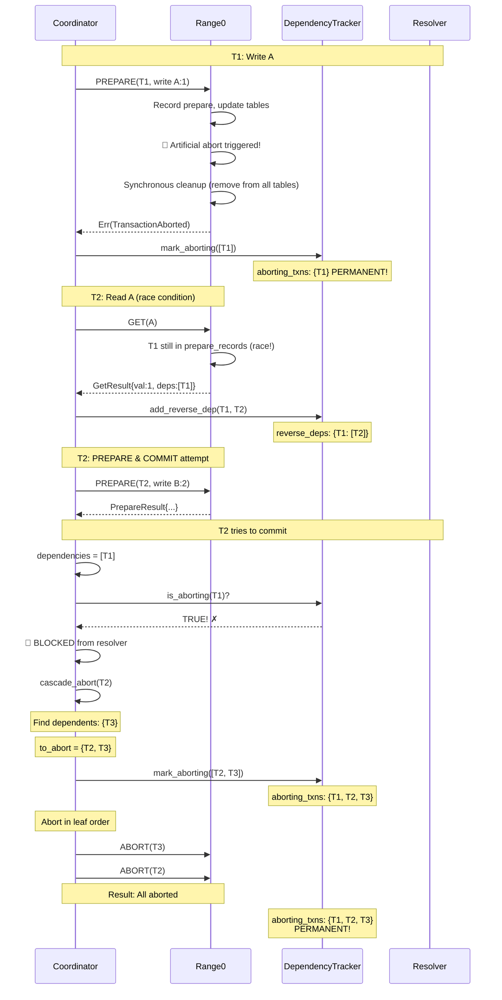

# Summary: Cascading Abort Flow

```mermaid
sequenceDiagram
    participant C as Coordinator
    participant R0 as Range0
    participant DT as DependencyTracker
    participant Res as Resolver

    Note over C,Res: T1: Write A
    C->>R0: PREPARE(T1, write A:1)
    R0->>R0: Record prepare, update tables
    R0->>R0: 🎲 Artificial abort triggered!
    R0->>R0: Synchronous cleanup (remove from all tables)
    R0-->>C: Err(TransactionAborted)
    C->>DT: mark_aborting([T1])
    Note over DT: aborting_txns: {T1} PERMANENT!

    Note over C,R0: T2: Read A (race condition)
    C->>R0: GET(A)
    R0->>R0: T1 still in prepare_records (race!)
    R0-->>C: GetResult{val:1, deps:[T1]}
    C->>DT: add_reverse_dep(T1, T2)
    Note over DT: reverse_deps: {T1: [T2]}

    Note over C,R0: T2: PREPARE & COMMIT attempt
    C->>R0: PREPARE(T2, write B:2)
    R0-->>C: PrepareResult{...}

    Note over C,Res: T2 tries to commit
    C->>C: dependencies = [T1]
    C->>DT: is_aborting(T1)?
    DT-->>C: TRUE! ✗
    C->>C: 🛑 BLOCKED from resolver
    C->>C: cascade_abort(T2)

    Note over C: Find dependents: {T3}
    Note over C: to_abort = {T2, T3}
    C->>DT: mark_aborting([T2, T3])
    Note over DT: aborting_txns: {T1, T2, T3}

    Note over C: Abort in leaf order
    C->>R0: ABORT(T3)
    C->>R0: ABORT(T2)

    Note over C,R0: Result: All aborted
    Note over DT: aborting_txns: {T1, T2, T3}<br/>PERMANENT!
```

**Result:** T1 ✗ (artificial) → T2 ✗ (cascading) → T3 ✗ (cascading)

**Key Protection:** Resolver never receives T2 → no deadlock!

---

