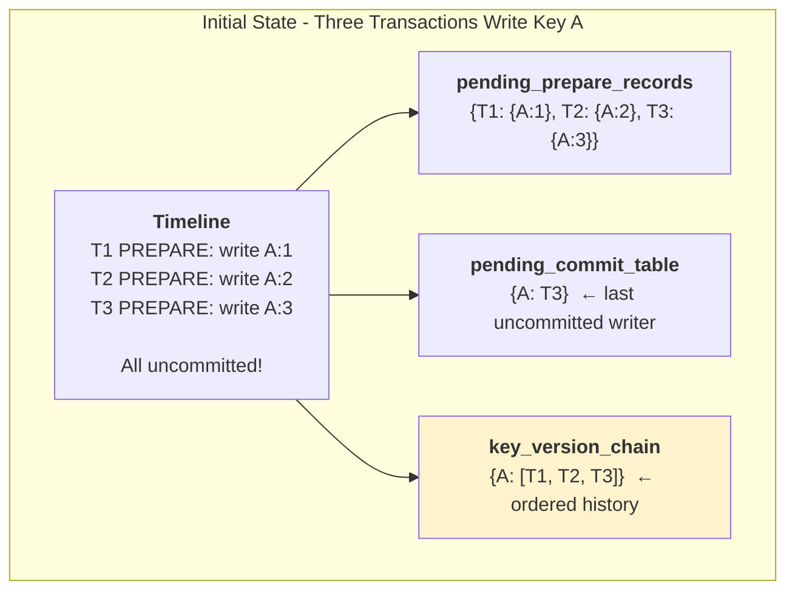
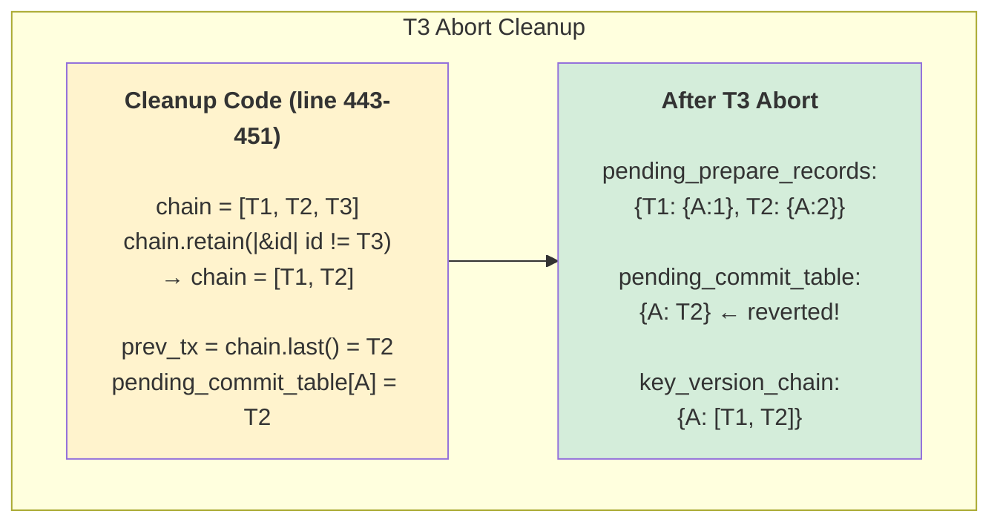
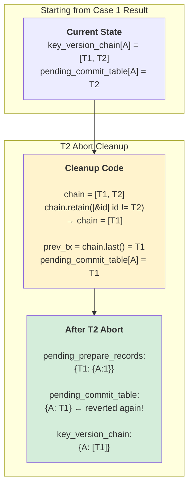
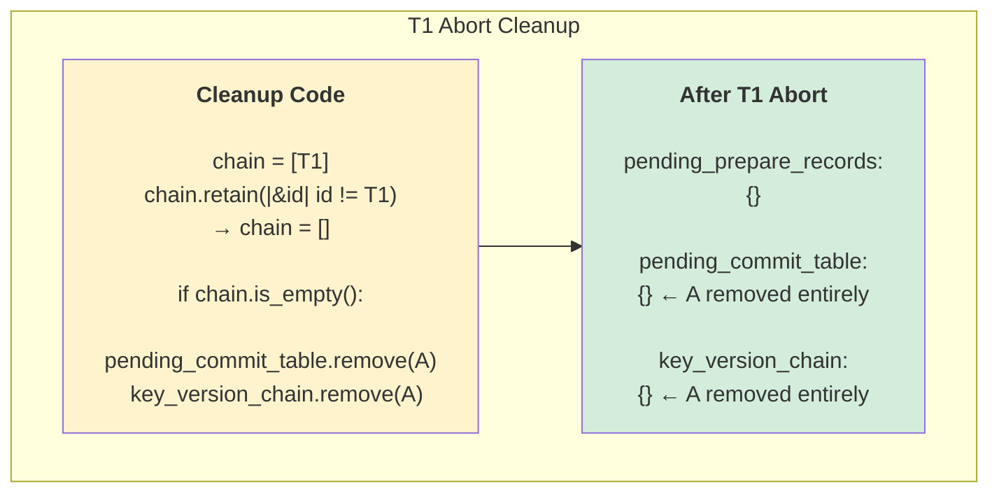
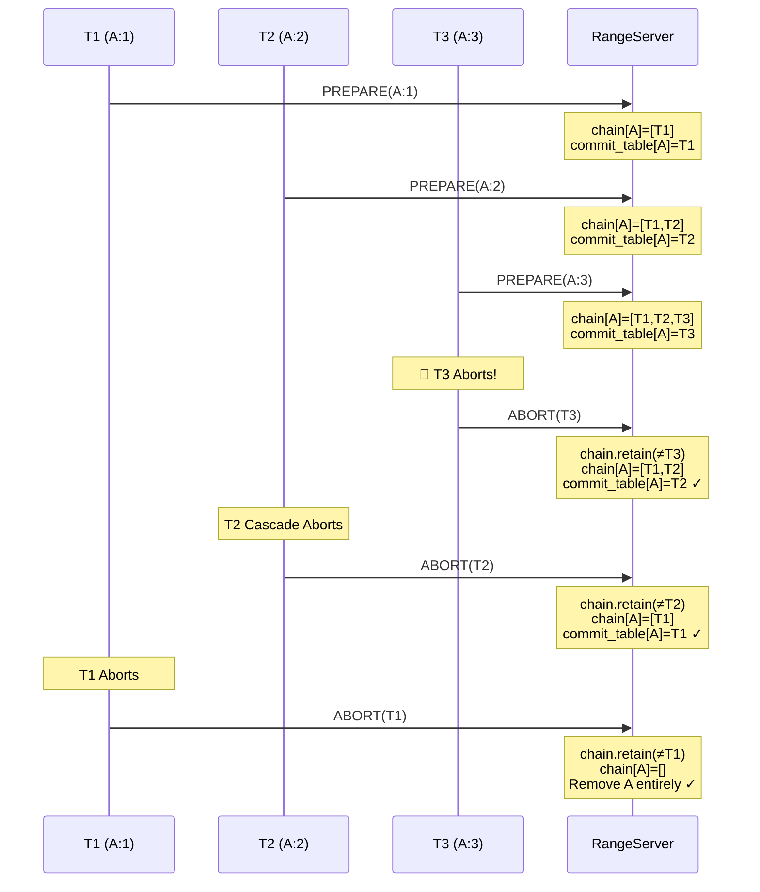

# Key Version Chain Cleanup Mechanism

**Why this wasn't highlighted before:** The previous diagrams showed simple scenarios where only one transaction wrote to each key (T1→A, T2→B, T3→C). In those cases, cleanup is straightforward - just remove the entry. But when **multiple transactions write to the SAME key**, we need `key_version_chain` to properly revert `pending_commit_table` to the previous uncommitted writer.

---

## The Problem

When T2 aborts but T1 and T3 also wrote to the same key, we need to know:
- **Who was the previous uncommitted writer before T2?**
- **Who is the next uncommitted writer after T2?**

This is what `key_version_chain` solves.

---

## Scenario: Multiple Writers to Same Key



---

## Case 1: T3 Aborts (Last Writer)



**Key Insight:** `pending_commit_table[A]` reverted from T3 to T2 using `key_version_chain`.

**Why this matters:** If T4 does `GET(A)` now, it will correctly depend on T2 (not T3).

---

## Case 2: T2 Aborts (Middle Writer)



**Key Insight:** Even though T2 was in the middle, cleanup still works correctly.

---

## Case 3: T1 Aborts (Last Remaining Writer)



**Key Insight:** When last writer aborts, key A is completely removed from tracking.

**Why this matters:** If T4 does `GET(A)` now, it reads from Cassandra (committed data) with no dependencies.

---

## The Algorithm (rangeserver/src/range_manager/impl.rs:443-451)

```rust
for key in prepare_record.changes.keys() {
    if let Some(chain) = pending_state.key_version_chain.get_mut(key) {
        // 1. Remove aborting transaction from chain
        chain.retain(|&id| id != tx.id);

        // 2. Revert pending_commit_table to previous uncommitted writer
        if let Some(&prev_tx) = chain.last() {
            // Still have uncommitted writers → update to previous
            pending_state.pending_commit_table.insert(key.clone(), prev_tx);
        } else {
            // No more uncommitted writers → remove key entirely
            pending_state.pending_commit_table.remove(key);
            pending_state.key_version_chain.remove(key);
        }
    }
}
```

---

## Why This Mechanism is Critical

### Without `key_version_chain`:

```
T1, T2, T3 all write A
pending_commit_table[A] = T3

T3 aborts...
❌ How do we know T2 was the previous writer?
❌ We'd have to scan all pending_prepare_records!
❌ O(n) operation for every abort!
```

### With `key_version_chain`:

```
key_version_chain[A] = [T1, T2, T3]

T3 aborts:
✓ chain.retain(|&id| id != T3) → [T1, T2]
✓ chain.last() → T2
✓ pending_commit_table[A] = T2
✓ O(1) operation!
```

---

## Complete Example Timeline



---

## Summary

| Data Structure | Role in Cleanup |
|----------------|-----------------|
| **key_version_chain** | Maintains ordered list of all writers to find previous uncommitted writer |
| **pending_commit_table** | Updated during cleanup to point to previous uncommitted writer |
| **pending_prepare_records** | Transaction entry simply removed (no revert needed) |

**Why it wasn't highlighted before:** The original diagrams (T1→A, T2→B, T3→C) had no overlapping writes, so cleanup was trivial (just remove). This mechanism only becomes critical when **multiple transactions write to the same key** - a common real-world scenario in high-contention workloads.

**Performance:** O(k) where k = number of writers to the key (typically small), vs O(n) scanning all transactions.
