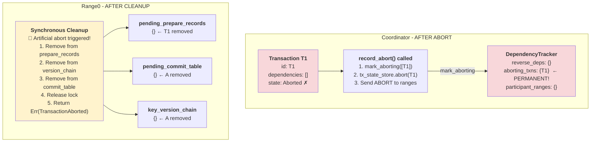
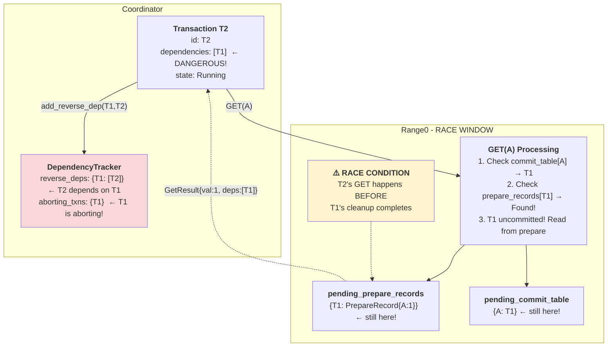
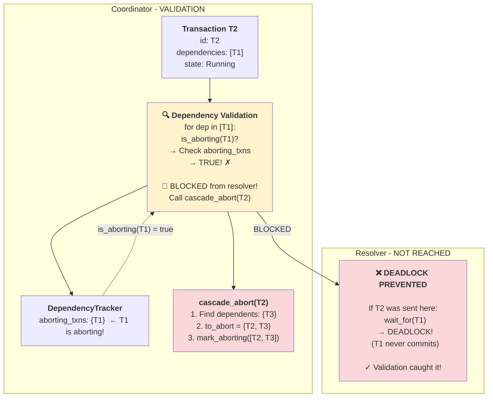
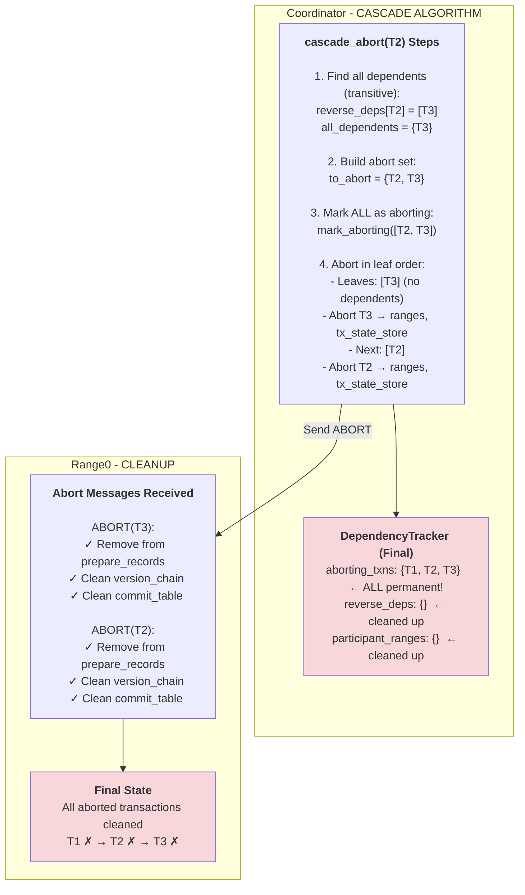
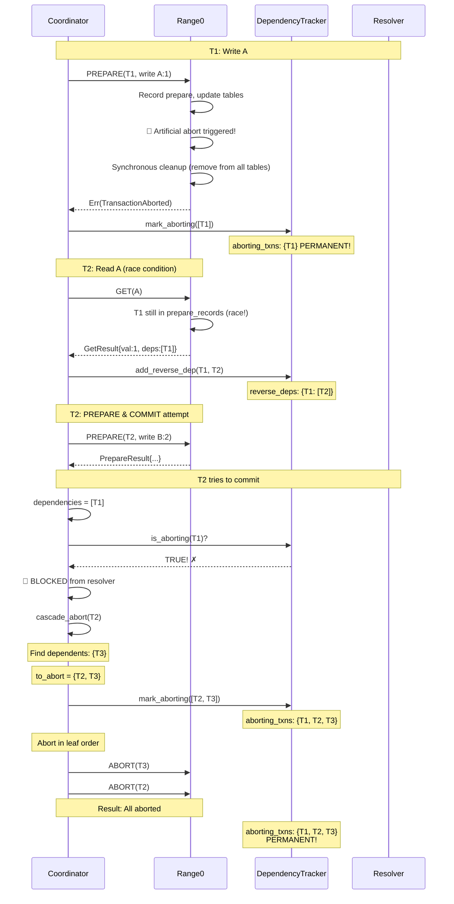

# Cascading Abort Path: Pipelined 2PC Data Structure Evolution

## Scenario
- **T1**: Writes key A (value 0→1) → **🎲 ARTIFICIAL ABORT** ✗
- **T2**: Reads A (from aborting T1) → **CASCADE ABORT** ✗
- **T3**: Reads B (from T2) → **CASCADE ABORT** ✗

---

## Phase 1: T1 PREPARE with Artificial Abort



**What happened:**
1. T1 reaches PREPARE phase in Range0
2. **Artificial abort triggered** (random < abort_rate)
3. **Synchronous cleanup** (while holding lock):
   - Remove T1 from `pending_prepare_records`
   - Remove T1 from `key_version_chain[A]`
   - Remove A from `pending_commit_table`
4. Release lock
5. Return `Err(TransactionAborted)` to coordinator
6. Coordinator calls `record_abort()`:
   - **CRITICAL**: `mark_aborting([T1])`
   - T1 added to `aborting_transactions` **PERMANENTLY**
   - Send ABORT to all ranges

**Key Insight:** T1 marked in `aborting_transactions` forever. Any future `is_aborting(T1)` returns `true`.

---

## Phase 2: T2 GET(A) - Race Condition



**What happened (race condition):**
1. T2 does GET(A) **before** T1's cleanup completes
2. Range0 finds: `pending_commit_table[A] = T1` ✓
3. Range0 finds: `pending_prepare_records[T1]` → **Still exists!**
4. Read T1's uncommitted value
5. Return: `GetResult{val: 1, dependencies: [T1]}`
6. Coordinator adds: `reverse_deps[T1] = [T2]`

**Dangerous state:**
- T2 depends on T1
- But T1 is in `aborting_transactions`!
- If T2 sent to resolver → **DEADLOCK** (waits for T1 to commit, which will never happen)

**Key Insight:** This race is why we need dependency validation before sending to resolver!

---

## Phase 3: T2 COMMIT - Validation Prevents Deadlock



**What happened:**
1. T2 completes PREPARE, tries to commit
2. T2 has `dependencies = [T1]` → would normally go to resolver
3. **VALIDATION CHECK** (coordinator/src/transaction.rs:597-617):
   ```rust
   for dep in dependencies {  // [T1]
       if is_aborting(dep) {  // is_aborting(T1)?
           // Check aborting_transactions set
           // → TRUE! (T1 was marked in Phase 1)
           cascade_abort(T2);
           return Err(CascadingAbort);
       }
   }
   ```
4. **T2 BLOCKED** from resolver!
5. Call `cascade_abort(T2)`

**Critical insight:**
- **Without this check**: T2 sent to resolver
- Resolver calls `wait_for(T1)` → **DEADLOCK** (T1 never commits)
- **With this check**: T2 caught early, cascade abort triggered

**This is the key fix that prevents resolver deadlock!**

---

## Phase 4: Cascade Abort Propagation (T2 → T3)



**What happened (cascade_abort algorithm):**

1. **Find all dependents** (line 275-280):
   ```rust
   let all_dependents = find_all_dependents(&dependency_tracker, T2, &mut visited);
   // Searches reverse_deps transitively
   // reverse_deps[T2] = [T3]
   // Result: {T3}
   ```

2. **Build full abort set** (line 279-280):
   ```rust
   let mut to_abort = all_dependents;  // {T3}
   to_abort.insert(T2);                // {T2, T3}
   ```

3. **Mark all as aborting** (line 283-284):
   ```rust
   dependency_tracker.mark_aborting(&[T2, T3]).await;
   // aborting_transactions: {T1, T2, T3}  ← ALL permanent!
   ```

4. **Abort in leaf-to-root order** (line 286-351):
   ```rust
   while !to_abort.is_empty() {
       // Find leaves: transactions with no dependents in to_abort set
       let leaves = find_leaves(&to_abort);  // [T3]

       for tx_id in leaves {
           // Send ABORT to all ranges
           for range_id in participant_ranges[tx_id] {
               range_client.abort_transaction(tx_id, range_id).await;
           }

           // Abort in tx_state_store
           tx_state_store.try_abort_transaction(tx_id).await;

           // Clean up dependency tracker
           dependency_tracker.remove_reverse_deps(tx_id).await;
           dependency_tracker.remove_participant_ranges(tx_id).await;

           // NOTE: We do NOT unmark_aborting(tx_id)!
           // Transaction stays in aborting set FOREVER

           to_abort.remove(tx_id);
       }
       // Next iteration: to_abort = {T2}
       // T2 is now a leaf → abort T2...
   }
   ```

**Final state:**
```
DependencyTracker:
  aborting_transactions: {T1, T2, T3}  ← PERMANENT markers
  reverse_deps: {}                      ← All cleaned up
  participant_ranges: {}                ← All cleaned up

Transactions:
  T1: Aborted (artificial)
  T2: Aborted (cascading)
  T3: Aborted (cascading)
```

**Key Insight:** Leaf-to-root order ensures dependencies are aborted before dependents. `aborting_transactions` set is permanent - never cleared.

---

## Summary: Cascading Abort Flow



**Result:** T1 ✗ (artificial) → T2 ✗ (cascading) → T3 ✗ (cascading)

**Key Protection:** Resolver never receives T2 → no deadlock!

---

## Critical Implementation Details

### 1. Why `aborting_transactions` is Permanent

**Problem (TOCTOU race):**
```
1. T1 aborts, cleanup completes
2. If we called unmark_aborting(T1)  ← BAD!
3. T2 reads A (race: depends on T1)
4. T2 checks: is_aborting(T1)? → FALSE (was unmarked!)
5. T2 sent to resolver
6. Resolver waits for T1 → DEADLOCK!
```

**Solution:**
```rust
// Never call unmark_aborting()
// Once marked, stays marked FOREVER
```

**Benefit:** Any future check always returns `true`, preventing all TOCTOU races.

---

### 2. Why Both `record_abort()` and `cascade_abort()` Need `mark_aborting()`

**Two abort paths based on `any_early_lock_releases` flag:**

| Path | When | Example |
|------|------|---------|
| `record_abort()` | Abort **before** any early lock release | T1 aborts on first PREPARE |
| `cascade_abort()` | Abort **after** early lock release | T2 with dependencies aborts |

**Bug:** Originally `record_abort()` didn't call `mark_aborting()`!
- Aborts on first PREPARE weren't tracked
- Dependent transactions couldn't detect them

**Fix:** Both paths now call `mark_aborting()` → complete tracking.

---

### 3. Synchronous Cleanup in RangeServer

```rust
// In rangeserver PREPARE phase:
if should_artificially_abort {
    // BEFORE releasing lock:
    {
        let mut pending_state = state.pending_state.write().await;

        // Remove from all tracking structures
        pending_state.pending_prepare_records.remove(&tx.id);

        for key in prepare_record.changes.keys() {
            if let Some(chain) = pending_state.key_version_chain.get_mut(key) {
                chain.retain(|&id| id != tx.id);

                if let Some(&prev_tx) = chain.last() {
                    pending_state.pending_commit_table.insert(key.clone(), prev_tx);
                } else {
                    pending_state.pending_commit_table.remove(key);
                    pending_state.key_version_chain.remove(key);
                }
            }
        }
    }  // Lock released here

    // AFTER cleanup complete:
    state.lock_table.release(None).await;
    return Err(Error::TransactionAborted);
}
```

**Benefit:** Minimizes race window where other transactions could see stale state.
