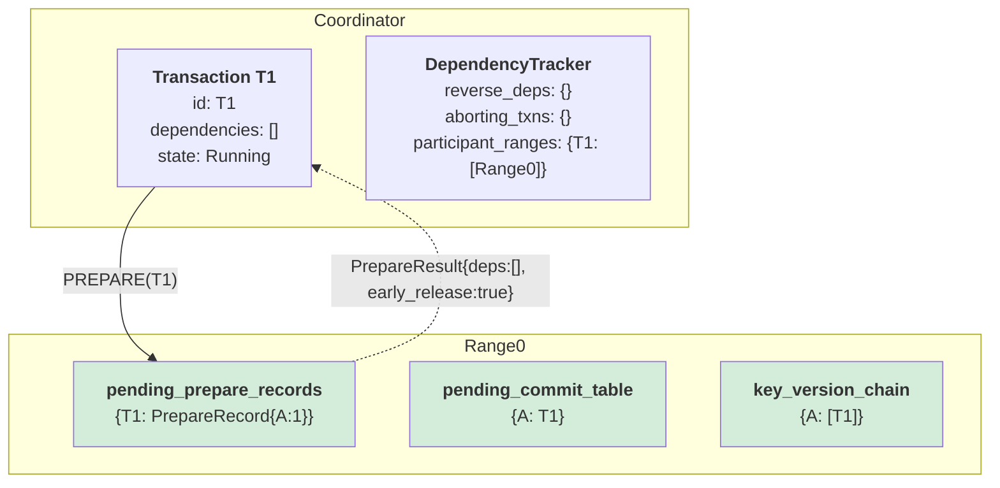

# Phase 1: T1 PREPARE

**What happened:**
1. Coordinator sends PREPARE(T1) to Range0
2. Range0 records prepare with changes {A:1}
3. Range0 updates `pending_commit_table[A] = T1`
4. Range0 adds T1 to `key_version_chain[A]`
5. **Lock released early** (pipelining!)
6. Returns PrepareResult with empty dependencies

**Key Insight:** T1 has no dependencies, will commit directly without resolver.

---

