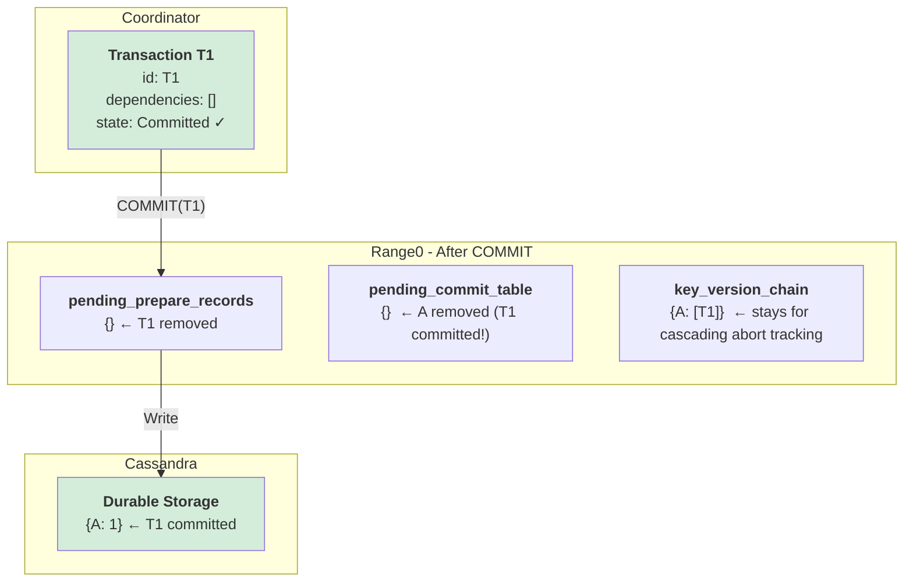

# Phase 2: T1 COMMIT (Direct)

**What happened:**
1. T1 has no dependencies → direct commit (skip resolver)
2. Coordinator commits T1 in tx_state_store
3. Coordinator sends COMMIT to Range0
4. Range0 removes T1 from `pending_prepare_records`
5. Range0 **removes A from `pending_commit_table`** (line 693) - no longer uncommitted!
6. Range0 **keeps T1 in `key_version_chain`** - used for cascading abort tracking
7. T1's value written to Cassandra (durable)

**Key Insight:** `pending_commit_table` tracks UNCOMMITTED writes only. Once committed, the entry is removed. But `key_version_chain` remains for cascading abort detection.

---

