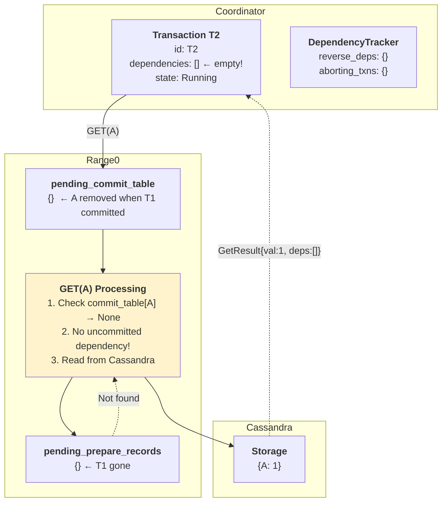

# Phase 3: T2 GET(A) - No Dependency Created

**What happened:**
1. T2 does GET(A)
2. Range0 checks: `pending_commit_table[A]` → **None** (line 205)
3. A is not in pending_commit_table → no uncommitted writer exists
4. Read from Cassandra (committed data)
5. Return: `GetResult{val: 1, dependencies: []}`

**Key Insight:** Since T1 committed, A was **removed from pending_commit_table** (line 693). This means T2 finds no uncommitted dependency and reads directly from Cassandra. No entry created in reverse_deps.

---

