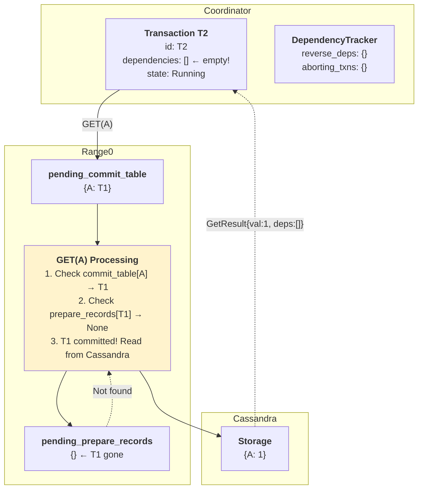

# Phase 3: T2 GET(A) - No Dependency Created

**What happened:**
1. T2 does GET(A)
2. Range0 checks: `pending_commit_table[A] = T1` ✓
3. Range0 checks: `pending_prepare_records[T1]` → **None** (T1 committed!)
4. Since T1 committed, read from Cassandra instead
5. Return: `GetResult{val: 1, dependencies: []}`

**Key Insight:** T2 has **NO dependency** on T1 because T1 already committed. No entry in reverse_deps.

---

