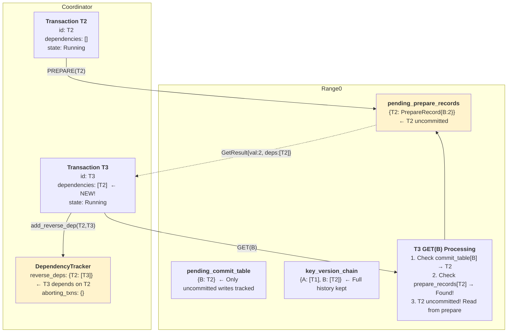

# Phase 4: T2 PREPARE & T3 GET(B) - Dependency Created

**What happened:**
1. T2 prepares (writes B), releases lock early
2. T3 does GET(B)
3. Range0 finds: `pending_commit_table[B] = T2`
4. Range0 finds: `pending_prepare_records[T2]` → **Exists!** (T2 uncommitted)
5. Read from T2's prepare record (dirty read)
6. Return: `GetResult{val: 2, dependencies: [T2]}`
7. Coordinator adds reverse dependency: `T2 → T3`

**Key Insight:** T3 **depends on uncommitted T2**. Must wait for T2 via resolver.

---

