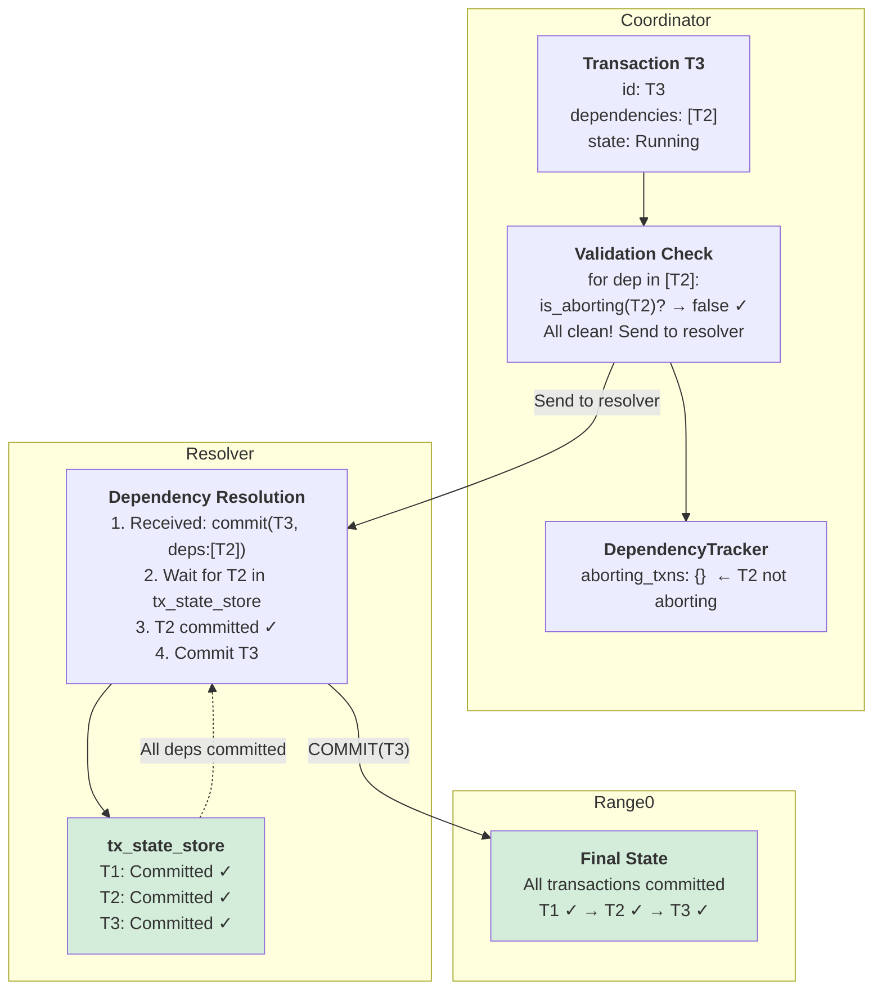
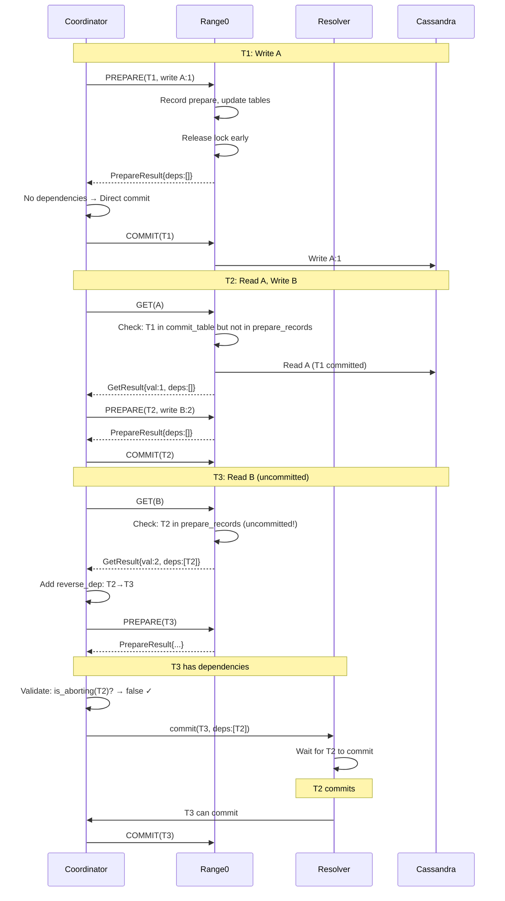

# Phase 5: T3 COMMIT via Resolver

**What happened:**
1. T3 tries to commit with dependencies: [T2]
2. **Validation check**: `is_aborting(T2)? → false` ✓
3. Safe to send to resolver
4. Resolver receives: `commit(T3, deps:[T2])`
5. Resolver waits for T2 in tx_state_store
6. T2 commits → T3 can now commit
7. All transactions committed successfully!

**Key Insight:** Validation prevents sending transactions with **aborted** dependencies to resolver (prevents deadlock).

---

## Summary: Happy Path Flow

**Result:** T1 ✓ → T2 ✓ → T3 ✓ (All committed successfully)
