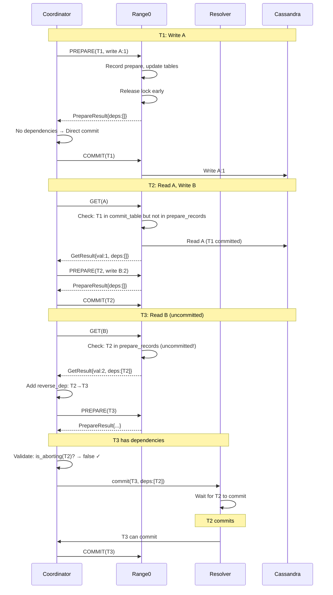

# Summary: Happy Path Flow

Complete sequence diagram showing all message flows between components.

## Result
✅ **T1 ✓ → T2 ✓ → T3 ✓** (All committed successfully)

## Key Observations

1. **T1**: No dependencies → direct commit (skip resolver)
2. **T2**: Reads from committed T1 → no dependency → direct commit
3. **T3**: Reads from uncommitted T2 → has dependency → uses resolver
4. **Validation**: `is_aborting(T2)? → false` allows T3 to proceed

## Data Flow Summary

| Transaction | Dependencies | Commit Path | Reason |
|-------------|--------------|-------------|--------|
| T1 | [] | Direct | No dependencies |
| T2 | [] | Direct | T1 committed before T2's GET |
| T3 | [T2] | Resolver | T2 uncommitted during T3's GET |

The resolver successfully waits for T2 to commit before committing T3.
