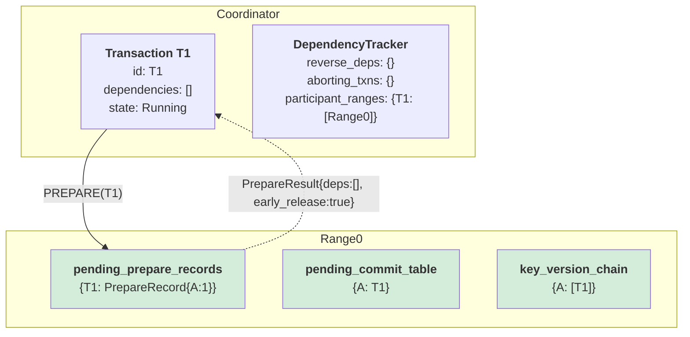
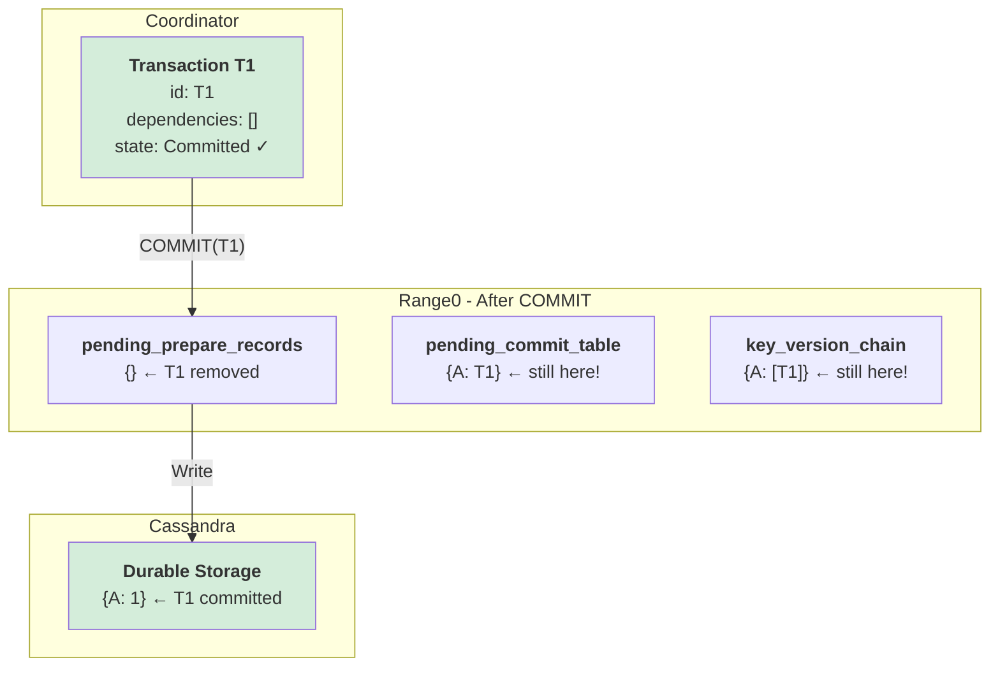
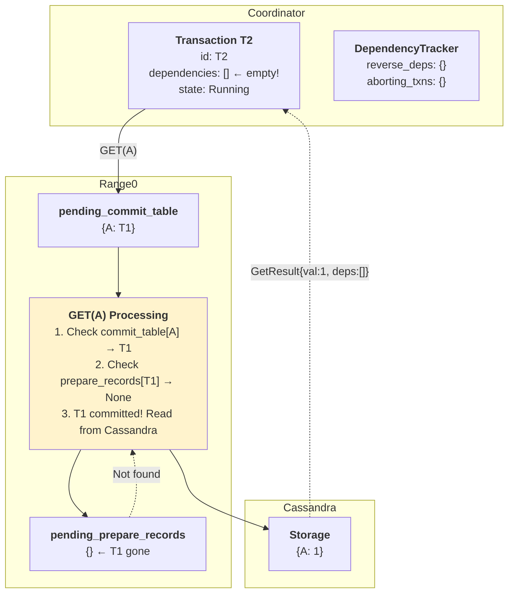
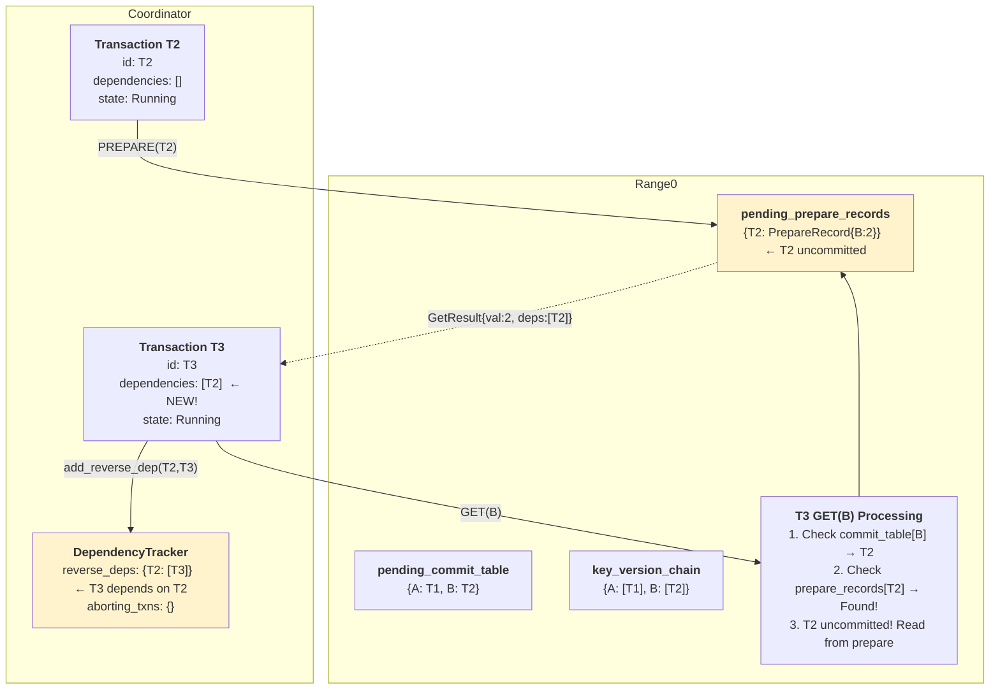
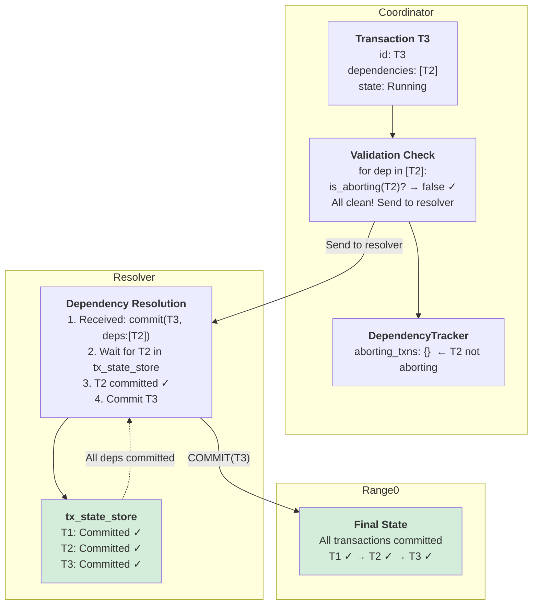
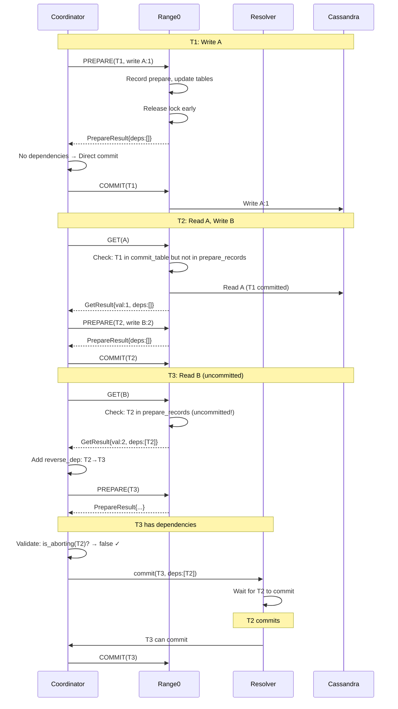

# Happy Path: Pipelined 2PC Data Structure Evolution

## Scenario
- **T1**: Writes key A (value 0→1) ✓
- **T2**: Reads A (from committed T1), writes B ✓
- **T3**: Reads B (from uncommitted T2), waits via resolver ✓

---

## Phase 1: T1 PREPARE

**What happened:**
1. Coordinator sends PREPARE(T1) to Range0
2. Range0 records prepare with changes {A:1}
3. Range0 updates `pending_commit_table[A] = T1`
4. Range0 adds T1 to `key_version_chain[A]`
5. **Lock released early** (pipelining!)
6. Returns PrepareResult with empty dependencies

**Key Insight:** T1 has no dependencies, will commit directly without resolver.

---

## Phase 2: T1 COMMIT (Direct)

**What happened:**
1. T1 has no dependencies → direct commit (skip resolver)
2. Coordinator commits T1 in tx_state_store
3. Coordinator sends COMMIT to Range0
4. Range0 removes T1 from `pending_prepare_records`
5. T1's value written to Cassandra (durable)

**Key Insight:** `pending_commit_table` and `key_version_chain` still contain T1 for tracking future dependencies.

---

## Phase 3: T2 GET(A) - No Dependency Created

**What happened:**
1. T2 does GET(A)
2. Range0 checks: `pending_commit_table[A] = T1` ✓
3. Range0 checks: `pending_prepare_records[T1]` → **None** (T1 committed!)
4. Since T1 committed, read from Cassandra instead
5. Return: `GetResult{val: 1, dependencies: []}`

**Key Insight:** T2 has **NO dependency** on T1 because T1 already committed. No entry in reverse_deps.

---

## Phase 4: T2 PREPARE & T3 GET(B) - Dependency Created

**What happened:**
1. T2 prepares (writes B), releases lock early
2. T3 does GET(B)
3. Range0 finds: `pending_commit_table[B] = T2`
4. Range0 finds: `pending_prepare_records[T2]` → **Exists!** (T2 uncommitted)
5. Read from T2's prepare record (dirty read)
6. Return: `GetResult{val: 2, dependencies: [T2]}`
7. Coordinator adds reverse dependency: `T2 → T3`

**Key Insight:** T3 **depends on uncommitted T2**. Must wait for T2 via resolver.

---

## Phase 5: T3 COMMIT via Resolver

**What happened:**
1. T3 tries to commit with dependencies: [T2]
2. **Validation check**: `is_aborting(T2)? → false` ✓
3. Safe to send to resolver
4. Resolver receives: `commit(T3, deps:[T2])`
5. Resolver waits for T2 in tx_state_store
6. T2 commits → T3 can now commit
7. All transactions committed successfully!

**Key Insight:** Validation prevents sending transactions with **aborted** dependencies to resolver (prevents deadlock).

---

## Summary: Happy Path Flow

**Result:** T1 ✓ → T2 ✓ → T3 ✓ (All committed successfully)
