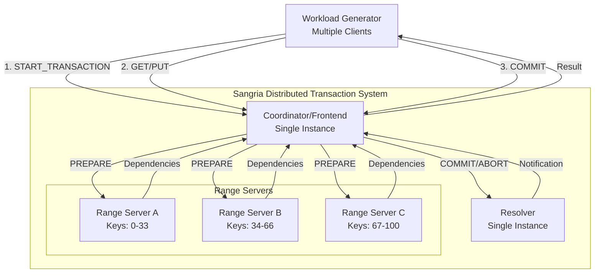
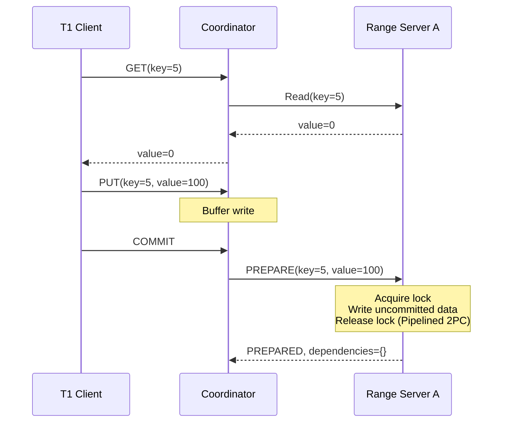
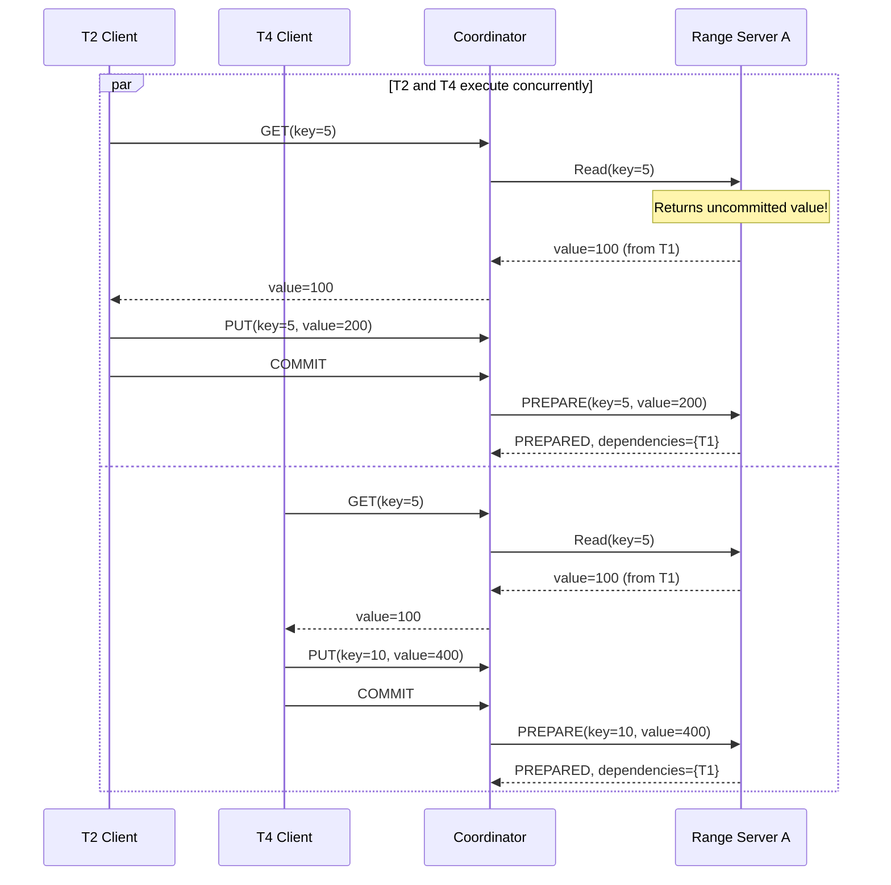
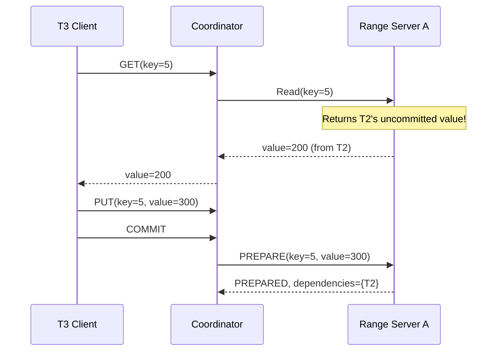
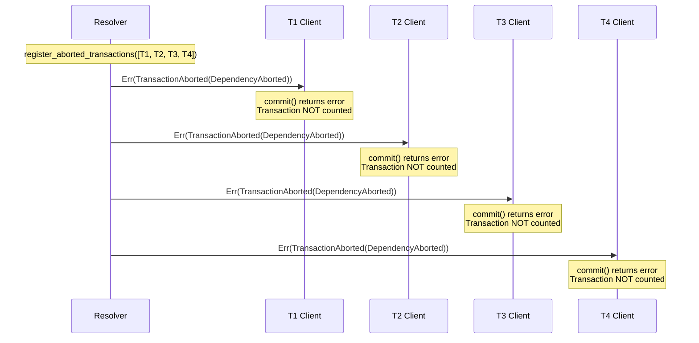
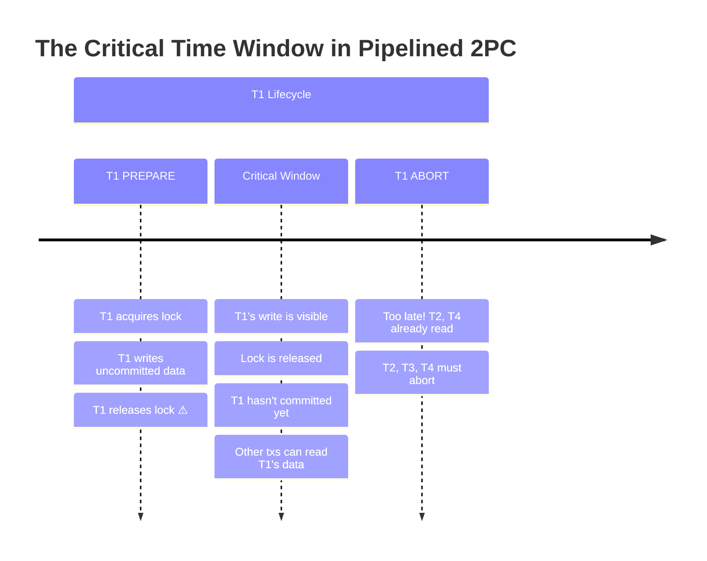
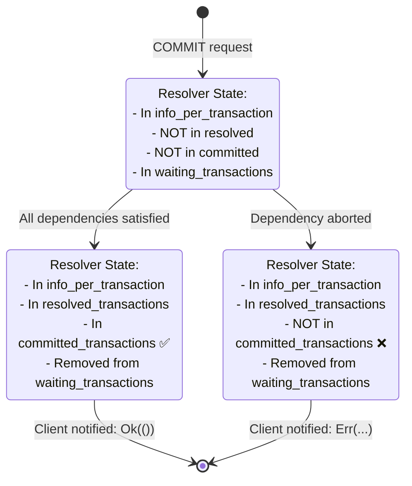
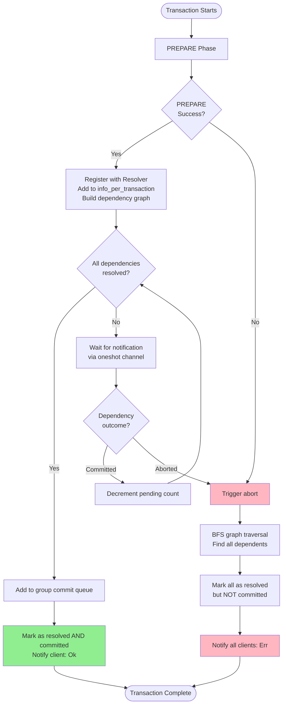

# Cascading Aborts: Visual Walkthrough with Data Structures

This document provides a step-by-step visual walkthrough of cascading aborts in Sangria, showing how data structures evolve as transactions are processed.

## System Architecture



**Key Points:**
- **1 Coordinator** routes all client requests
- **3 Range Servers** each manage a portion of the key space
- **1 Resolver** handles dependency resolution and cascading aborts
- **Multiple Clients** can have transactions in flight concurrently

## Component Data Structures

### Coordinator/Frontend

```rust
struct CoordinatorState {
    // Active transactions
    active_transactions: HashMap<Uuid, TransactionContext>,
}

struct TransactionContext {
    transaction_id: Uuid,
    read_set: Vec<Key>,
    write_set: HashMap<Key, Value>,
    client_channel: oneshot::Sender<Result<(), Error>>,
}
```

### Range Server

```rust
struct RangeServerState {
    // Key-value store
    data: HashMap<Key, Value>,

    // Uncommitted writes (visible after PREPARE, before COMMIT)
    uncommitted_writes: HashMap<Key, UncommittedWrite>,

    // Lock table
    locks: HashMap<Key, Uuid>,  // Key -> Transaction holding lock
}

struct UncommittedWrite {
    transaction_id: Uuid,
    value: Value,
    timestamp: Timestamp,
    dependency_set: HashSet<Uuid>,  // Who wrote this key before me
}
```

### Resolver

```rust
struct ResolverState {
    // All transaction metadata
    info_per_transaction: HashMap<Uuid, TransactionInfo>,

    // Transactions whose fate is decided (committed OR aborted)
    resolved_transactions: HashSet<Uuid>,

    // ONLY successfully committed transactions (subset of resolved)
    committed_transactions: HashSet<Uuid>,

    // Waiting clients
    waiting_transactions: HashMap<Uuid, oneshot::Sender<Result<(), Error>>>,
}

struct TransactionInfo {
    id: Uuid,
    num_dependencies: u32,          // How many txs must commit before me
    dependents: HashSet<Uuid>,      // Who is waiting on me
    participant_ranges: Vec<RangeId>,
}
```

## Cascading Abort Scenario: Step-by-Step Walkthrough

**Scenario Setup:**
- Key 5 → Range Server A
- Key 10 → Range Server A
- 4 transactions: T1, T2, T3, T4
- T1 will abort, triggering cascade

### Step 0: Initial State

**All Data Structures Empty**

**Range Server A:**
```rust
RangeServerState {
    data: {5: 0, 10: 0},  // Initial values
    uncommitted_writes: {},
    locks: {},
}
```

**Resolver:**
```rust
ResolverState {
    info_per_transaction: {},
    resolved_transactions: {},
    committed_transactions: {},
    waiting_transactions: {},
}
```

---

### Step 1: T1 Executes and Prepares

**Transaction T1:**
- `START_TRANSACTION`
- `GET(key=5)` → reads 0
- `PUT(key=5, value=100)`
- `COMMIT` → triggers PREPARE phase



**Range Server A After PREPARE:**
```rust
RangeServerState {
    data: {5: 0, 10: 0},  // Committed data unchanged
    uncommitted_writes: {
        5: UncommittedWrite {
            transaction_id: T1,
            value: 100,
            timestamp: t1,
            dependency_set: {},  // No dependencies
        }
    },
    locks: {},  // Lock released!
}
```

**Coordinator sends to Resolver:**
```
COMMIT(transaction_id=T1, dependencies={}, participant_ranges=[A])
```

**Resolver After T1 Registers:**
```rust
ResolverState {
    info_per_transaction: {
        T1: TransactionInfo {
            id: T1,
            num_dependencies: 0,  // No dependencies
            dependents: {},       // No one depends on T1 yet
            participant_ranges: [A],
        }
    },
    resolved_transactions: {},
    committed_transactions: {},
    waiting_transactions: {
        T1: oneshot::Sender<Result<(), Error>>,  // Client waiting
    },
}
```

**State Summary:**
- ✅ T1's write is visible in `uncommitted_writes` (key=5 value=100)
- ✅ Lock on key=5 is released
- ✅ T1 is waiting for notification in Resolver
- ⏳ T1 will be added to group commit queue

---

### Step 2: T2 and T4 Execute Concurrently (Both Depend on T1)

**Transaction T2 (concurrent with T4):**
- `START_TRANSACTION`
- `GET(key=5)` → reads **100** (T1's uncommitted write!)
- `PUT(key=5, value=200)`
- `COMMIT` → triggers PREPARE

**Transaction T4 (concurrent with T2):**
- `START_TRANSACTION`
- `GET(key=5)` → reads **100** (T1's uncommitted write!)
- `PUT(key=10, value=400)`
- `COMMIT` → triggers PREPARE



**Range Server A After T2 and T4 PREPARE:**
```rust
RangeServerState {
    data: {5: 0, 10: 0},
    uncommitted_writes: {
        5: UncommittedWrite {
            transaction_id: T2,  // T2 overwrote T1's uncommitted write
            value: 200,
            timestamp: t2,
            dependency_set: {T1},  // T2 depends on T1
        },
        10: UncommittedWrite {
            transaction_id: T4,
            value: 400,
            timestamp: t4,
            dependency_set: {T1},  // T4 depends on T1
        }
    },
    locks: {},
}
```

**Resolver After T2 and T4 Register:**

```rust
ResolverState {
    info_per_transaction: {
        T1: TransactionInfo {
            id: T1,
            num_dependencies: 0,
            dependents: {T2, T4},  // ← T2 and T4 added as dependents!
            participant_ranges: [A],
        },
        T2: TransactionInfo {
            id: T2,
            num_dependencies: 1,  // ← Waiting for T1
            dependents: {},
            participant_ranges: [A],
        },
        T4: TransactionInfo {
            id: T4,
            num_dependencies: 1,  // ← Waiting for T1
            dependents: {},
            participant_ranges: [A],
        },
    },
    resolved_transactions: {},
    committed_transactions: {},
    waiting_transactions: {
        T1: oneshot::Sender,
        T2: oneshot::Sender,  // ← Waiting for T1 to commit
        T4: oneshot::Sender,  // ← Waiting for T1 to commit
    },
}
```

**Dependency Graph at this point:**
```mermaid
graph TD
    T1[T1<br/>num_dependencies: 0<br/>dependents: {T2, T4}]
    T2[T2<br/>num_dependencies: 1<br/>dependents: {}]
    T4[T4<br/>num_dependencies: 1<br/>dependents: {}]

    T1 -->|T2 depends on T1| T2
    T1 -->|T4 depends on T1| T4
```

---

### Step 3: T3 Executes (Depends on T2)

**Transaction T3:**
- `START_TRANSACTION`
- `GET(key=5)` → reads **200** (T2's uncommitted write!)
- `PUT(key=5, value=300)`
- `COMMIT` → triggers PREPARE



**Range Server A After T3 PREPARE:**
```rust
RangeServerState {
    data: {5: 0, 10: 0},
    uncommitted_writes: {
        5: UncommittedWrite {
            transaction_id: T3,  // T3 overwrote T2's uncommitted write
            value: 300,
            timestamp: t3,
            dependency_set: {T2},  // T3 depends on T2 (not T1!)
        },
        10: UncommittedWrite {
            transaction_id: T4,
            value: 400,
            timestamp: t4,
            dependency_set: {T1},
        }
    },
    locks: {},
}
```

**Resolver After T3 Registers:**

```rust
ResolverState {
    info_per_transaction: {
        T1: TransactionInfo {
            id: T1,
            num_dependencies: 0,
            dependents: {T2, T4},
            participant_ranges: [A],
        },
        T2: TransactionInfo {
            id: T2,
            num_dependencies: 1,
            dependents: {T3},  // ← T3 added as dependent of T2!
            participant_ranges: [A],
        },
        T3: TransactionInfo {
            id: T3,
            num_dependencies: 1,  // ← Waiting for T2
            dependents: {},
            participant_ranges: [A],
        },
        T4: TransactionInfo {
            id: T4,
            num_dependencies: 1,
            dependents: {},
            participant_ranges: [A],
        },
    },
    resolved_transactions: {},
    committed_transactions: {},
    waiting_transactions: {
        T1: oneshot::Sender,
        T2: oneshot::Sender,
        T3: oneshot::Sender,  // ← Waiting for T2 to commit
        T4: oneshot::Sender,
    },
}
```

**Complete Dependency Graph:**
```mermaid
graph TD
    T1[T1<br/>num_dependencies: 0<br/>dependents: {T2, T4}]
    T2[T2<br/>num_dependencies: 1<br/>dependents: {T3}]
    T3[T3<br/>num_dependencies: 1<br/>dependents: {}]
    T4[T4<br/>num_dependencies: 1<br/>dependents: {}]

    T1 -->|T2 depends on T1| T2
    T1 -->|T4 depends on T1| T4
    T2 -->|T3 depends on T2| T3

    style T1 fill:#ffcccc
    style T2 fill:#ffffcc
    style T3 fill:#ffffcc
    style T4 fill:#ffffcc
```

**Critical Observation:**
- T3 depends on T2 directly (not T1)
- But T2 depends on T1
- So if T1 aborts → T2 must abort → T3 must abort (transitive dependency)

---

### Step 4: T1 Aborts! 🔥

**Abort Trigger:**
Range Server artificially aborts T1 (or real conflict detected):

```rust
// In Range Server during PREPARE or artificial abort injection
return Err(PrepareError::ArtificialAbort);
```

**Coordinator receives abort and notifies Resolver:**
```
ABORT(transaction_id=T1)
```

---

### Step 5: Cascading Abort - Graph Traversal

**Resolver.abort() executes BFS traversal:**

```rust
pub async fn abort(resolver: Arc<Self>, transaction_id: Uuid) -> Result<(), Error> {
    let mut transactions_to_abort = HashSet::new();
    transactions_to_abort.insert(T1);  // Start with T1

    {
        let state = resolver.state.read().await;
        let mut to_explore = vec![T1];

        // BFS traversal
        while let Some(tx_id) = to_explore.pop() {
            if let Some(tx_info) = state.info_per_transaction.get(&tx_id) {
                for dependent in &tx_info.dependents {
                    if transactions_to_abort.insert(*dependent) {
                        to_explore.push(*dependent);
                    }
                }
            }
        }
    }

    // Result: transactions_to_abort = {T1, T2, T3, T4}
}
```

**BFS Iteration Steps:**

```mermaid
graph TB
    subgraph Iteration1[Iteration 1: Explore T1]
        T1_1[Current: T1<br/>Find dependents: {T2, T4}]
        T1_1 --> Q1[to_explore: T4, T2<br/>transactions_to_abort: {T1, T2, T4}]
    end

    subgraph Iteration2[Iteration 2: Explore T4]
        T4_1[Current: T4<br/>Find dependents: {}]
        T4_1 --> Q2[to_explore: T2<br/>transactions_to_abort: {T1, T2, T4}]
    end

    subgraph Iteration3[Iteration 3: Explore T2]
        T2_1[Current: T2<br/>Find dependents: {T3}]
        T2_1 --> Q3[to_explore: T3<br/>transactions_to_abort: {T1, T2, T3, T4}]
    end

    subgraph Iteration4[Iteration 4: Explore T3]
        T3_1[Current: T3<br/>Find dependents: {}]
        T3_1 --> Q4[to_explore: empty<br/>transactions_to_abort: {T1, T2, T3, T4}]
    end

    Iteration1 --> Iteration2
    Iteration2 --> Iteration3
    Iteration3 --> Iteration4
```

**Result:** `transactions_to_abort = {T1, T2, T3, T4}`

**Console Output:**
```
Aborting transaction T1 and cascading to dependents
Cascading abort to dependent transaction T2
Cascading abort to dependent transaction T4
Cascading abort to dependent transaction T3
Collected 4 transactions to abort (including dependents)
```

---

### Step 6: Register Aborted Transactions

**Resolver.register_aborted_transactions() executes:**

```rust
pub async fn register_aborted_transactions(
    resolver: Arc<Self>,
    transaction_ids: Vec<Uuid>,  // [T1, T2, T3, T4]
) -> Result<(), Error> {
    {
        let mut state = resolver.state.write().await;

        // Mark all as resolved (fate decided) but NOT committed
        for transaction_id in &transaction_ids {
            state.resolved_transactions.insert(*transaction_id);
            // DO NOT add to committed_transactions!
        }
    }

    // Notify all waiting clients with error
    let mut waiting_transactions = resolver.waiting_transactions.write().await;
    for transaction_id in &transaction_ids {
        if let Some(sender) = waiting_transactions.remove(transaction_id) {
            let _ = sender.send(Err(Error::TransactionAborted(
                TransactionAbortReason::DependencyAborted
            )));
        }
    }
}
```

**Resolver Final State:**

```rust
ResolverState {
    info_per_transaction: {
        T1: TransactionInfo { /* unchanged */ },
        T2: TransactionInfo { /* unchanged */ },
        T3: TransactionInfo { /* unchanged */ },
        T4: TransactionInfo { /* unchanged */ },
    },
    resolved_transactions: {T1, T2, T3, T4},  // ← All marked resolved!
    committed_transactions: {},  // ← NONE committed!
    waiting_transactions: {},  // ← All removed (notifications sent)
}
```

**Notification Flow:**



**Console Output:**
```
Registering 4 transactions as aborted
Transaction T1 marked as resolved (aborted)
Transaction T2 marked as resolved (aborted)
Notified transaction T2 of abort
Transaction T3 marked as resolved (aborted)
Notified transaction T3 of abort
Transaction T4 marked as resolved (aborted)
Notified transaction T4 of abort
```

---

### Step 7: Client Error Handling

**Each client receives the error:**

```rust
// workload-generator/src/transaction_impl/rw_transaction.rs:127-134
client_clone
    .commit(CommitRequest {
        transaction_id: transaction_id.to_string(),
    })
    .await
    .map_err(|e| FrontendError::InternalError(Arc::new(e)))?;
    // ↑ Returns Err, propagated with ?
    // Transaction NOT counted as committed
```

**Workload generator handles the error:**
- Transaction is NOT counted in `total_transactions` metric
- Transaction is counted as failed/aborted
- Throughput calculation only includes successfully committed transactions

---

## Summary: The Critical Time Window

**Why Cascading Aborts Happen:**



**Key Insight:**
1. **PREPARE phase**: Lock released, write visible, transaction not committed
2. **Critical window**: Between PREPARE and COMMIT/ABORT
3. **Pipelined 2PC**: Allows concurrent reads during this window (higher throughput)
4. **Cost**: If T1 aborts, all readers of T1's data must also abort (cascading)

## Data Structure State Transitions



## Why Two Sets? (resolved vs committed)

**Question:** Why have both `resolved_transactions` and `committed_transactions`?

**Answer:** For efficient dependency checking when new transactions arrive:

```rust
// When transaction T5 arrives with dependency on T1
for dependency in dependencies {  // dependency = T1
    if !state.resolved_transactions.contains(&T1) {
        // T1's fate not decided yet → T5 must wait
        num_pending_dependencies += 1;

        // Add T5 as dependent of T1
        state.info_per_transaction
            .entry(T1)
            .or_insert_default()
            .dependents
            .insert(T5);
    } else {
        // T1's fate is decided (committed OR aborted)
        // If committed: T5 can proceed safely
        // If aborted: T5 will be caught in next cascade
        // Either way, T5 doesn't need to wait
    }
}
```

**The check is:** "Has T1's fate been decided?" not "Did T1 commit?"

- `resolved_transactions`: Fast check for "is fate decided?"
- `committed_transactions`: Determines if fate was commit or abort

## Experimental Results

As shown in the experiment results (`experiment_results/cascading_aborts_summary.csv`):

| Abort Rate | Mean Throughput | Std Dev | Mean Committed Txns |
|------------|-----------------|---------|---------------------|
| 5%         | 509.64 txn/s    | 267.44  | 92.5                |
| 15%        | 349.09 txn/s    | 214.33  | 68.0 (-26.5%)       |
| 30%        | 213.31 txn/s    | 163.90  | 42.5 (-54.1%)       |

**Amplification Effect:**
- 5% direct abort rate → 7.5% failed transactions (92.5 / 100)
- 15% direct abort rate → 32% failed transactions (68 / 100)
- 30% direct abort rate → 57.5% failed transactions (42.5 / 100)

**Why amplification?** Each aborted transaction cascades to all its dependents, who cascade to their dependents, creating a multiplier effect.

## Complete Data Flow Diagram



## Key Takeaways

1. **Pipelined 2PC trades safety for performance**: Locks released early, enabling higher concurrency but risking cascading aborts

2. **Dependency graph is critical**: The `dependents` HashSet in `TransactionInfo` enables efficient cascading abort via BFS traversal

3. **Two-set design optimizes checking**: `resolved_transactions` for "fate decided" check, `committed_transactions` for actual outcome

4. **Oneshot channels enable async notification**: Changed from `Sender<()>` to `Sender<Result<(), Error>>` to distinguish commits from aborts

5. **Cascading aborts are immediate**: No batching like group commits, aborts propagate instantly to free resources

6. **Amplification effect is significant**: Small abort rates can cause much larger throughput degradation due to transitive dependencies

## Code References

- **Resolver dependency tracking**: `resolver/src/core/resolver.rs:86-104`
- **Cascading abort traversal**: `resolver/src/core/resolver.rs:275-305`
- **Abort notification**: `resolver/src/core/resolver.rs:307-357`
- **Client error handling**: `workload-generator/src/transaction_impl/rw_transaction.rs:127-134`
- **Range server uncommitted writes**: `range-server/src/state.rs`
