# Cascading Aborts: Visual Walkthrough

This document walks through how cascading aborts work in Sangria with visual Mermaid diagrams showing data structure updates at each step.

## System Architecture

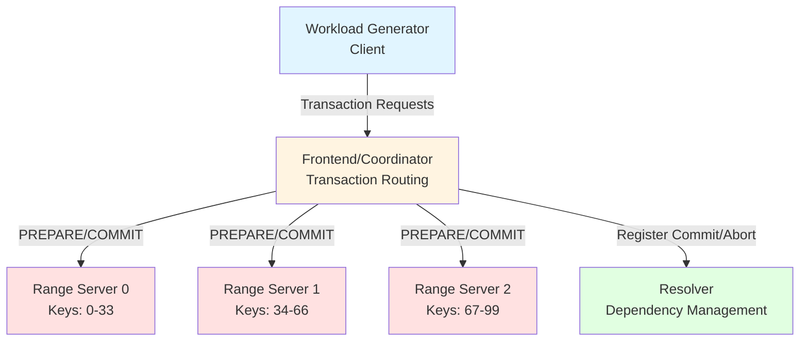

**Setup:**
- **1 Frontend/Coordinator**: Routes all transaction requests
- **3 Range Servers**: Each manages a partition of the key space
  - Range 0: keys 0-33
  - Range 1: keys 34-66
  - Range 2: keys 67-99
- **1 Resolver**: Tracks dependencies and handles cascading aborts

## Scenario: Cascading Abort with 4 Transactions

We'll walk through a scenario where:
- **T1** writes to two ranges and then aborts
- **T2** reads T1's data and becomes dependent on T1
- **T3** reads T2's data and becomes dependent on T2
- **T4** reads T1's data and becomes dependent on T1

**Result**: When T1 aborts, T2, T3, and T4 must all cascade abort.

### Transaction Details

```
T1: Write key=5 (Range 0), key=35 (Range 1)
T2: Read key=5, Write key=5 (Range 0)           → Depends on T1
T3: Read key=5, Write key=70 (Range 0 & 2)      → Depends on T2
T4: Read key=5, Write key=36 (Range 0 & 1)      → Depends on T1
```

**Dependency Graph:**
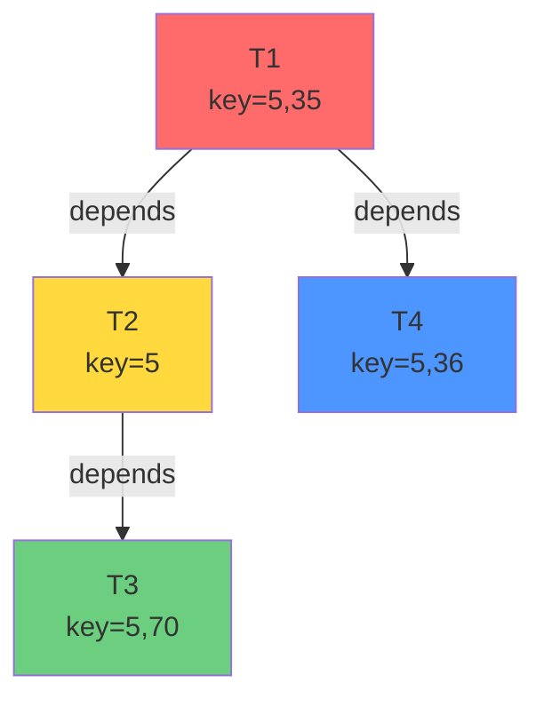

## Step-by-Step Walkthrough

### Step 0: Initial State

All data structures are empty. No transactions in flight.

**Resolver State:**
```mermaid
graph LR
    subgraph Resolver.State
        IPT[info_per_transaction: {}]
        RT[resolved_transactions: {}]
        CT[committed_transactions: {}]
    end

    subgraph Resolver.waiting_transactions
        WT[waiting_transactions: {}]
    end
```

**Range Server Lock Tables:**
```
Range 0: {}
Range 1: {}
Range 2: {}
```

---

### Step 1: T1 Executes and Prepares

**Timeline:**
1. T1 reads initial values from Range 0 (key=5) and Range 1 (key=35)
2. T1 writes: key=5 → value=100, key=35 → value=200
3. Frontend sends PREPARE to Range 0 and Range 1
4. Range servers lock keys, detect no conflicts, return empty dependency set
5. **Pipelined 2PC**: Range servers release locks immediately after PREPARE
6. T1's writes are now visible to other transactions
7. Frontend calls Resolver.commit(T1, dependencies=[], ranges=[0,1])

**Sequence Diagram:**
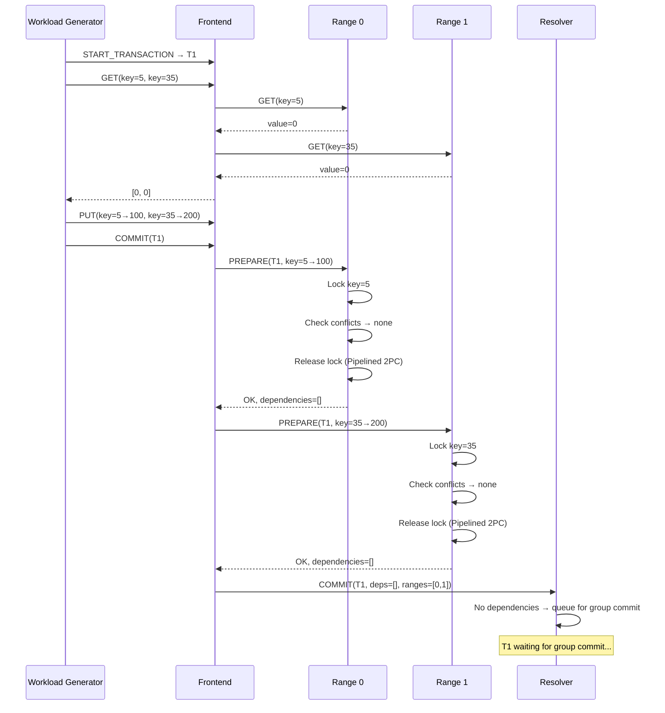

**Resolver State After T1 Registers:**
```mermaid
graph TB
    subgraph Resolver.State
        IPT["info_per_transaction:<br/>{<br/>  T1: {<br/>    num_dependencies: 0,<br/>    dependents: {},<br/>    ranges: [0, 1]<br/>  }<br/>}"]
        RT[resolved_transactions: {}]
        CT[committed_transactions: {}]
    end

    subgraph Resolver.waiting_transactions
        WT["waiting_transactions:<br/>{<br/>  T1: oneshot_sender<br/>}"]
    end
```

**Range Server States:**
```
Range 0: {key=5: value=100, locked=false}  ← T1's write visible
Range 1: {key=35: value=200, locked=false} ← T1's write visible
Range 2: {}
```

**Key Point**: T1's writes are visible but T1 hasn't committed yet. This is the critical window where other transactions can read T1's uncommitted data.

---

### Step 2: T2 Executes and Prepares

**Timeline:**
1. T2 reads key=5 from Range 0 → sees T1's write (value=100)
2. T2 writes: key=5 → value=300
3. Frontend sends PREPARE to Range 0
4. Range 0 detects: "T2 read data written by T1" → returns dependency=[T1]
5. Range 0 releases lock (Pipelined 2PC)
6. Frontend calls Resolver.commit(T2, dependencies=[T1], ranges=[0])

**Sequence Diagram:**
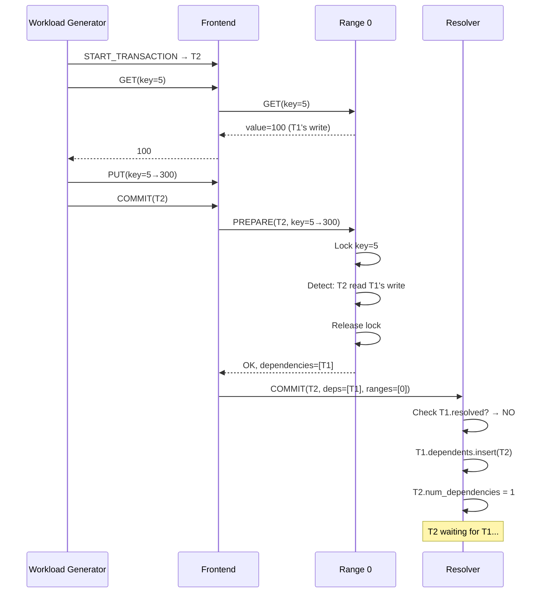

**Resolver State After T2 Registers:**
```mermaid
graph TB
    subgraph Resolver.State
        IPT["info_per_transaction:<br/>{<br/>  T1: {<br/>    num_dependencies: 0,<br/>    dependents: {T2},  ← UPDATED<br/>    ranges: [0, 1]<br/>  },<br/>  T2: {<br/>    num_dependencies: 1,  ← Must wait for T1<br/>    dependents: {},<br/>    ranges: [0]<br/>  }<br/>}"]
        RT[resolved_transactions: {}]
        CT[committed_transactions: {}]
    end

    subgraph Resolver.waiting_transactions
        WT["waiting_transactions:<br/>{<br/>  T1: oneshot_sender,<br/>  T2: oneshot_sender<br/>}"]
    end
```

**Critical Code (resolver.rs:86-104):**
```rust
// When T2 registers with dependency on T1
for dependency in dependencies {  // dependency = T1
    if !state.resolved_transactions.contains(&T1) {
        // T1 not resolved yet → T2 must wait
        num_pending_dependencies += 1;  // T2.num_dependencies = 1

        // Add reverse edge for cascading aborts
        state.info_per_transaction
            .entry(T1)
            .or_insert(TransactionInfo::default(T1, false))
            .dependents
            .insert(T2);  // T1.dependents = {T2}
    }
}
```

---

### Step 3: T4 Executes and Prepares

**Timeline:**
1. T4 reads key=5 from Range 0 → sees T1's write (value=100)
2. T4 writes: key=36 → value=400
3. Frontend sends PREPARE to Range 0 and Range 1
4. Range 0 returns dependency=[T1]
5. Range 1 returns dependency=[]
6. Frontend calls Resolver.commit(T4, dependencies=[T1], ranges=[0,1])

**Sequence Diagram:**
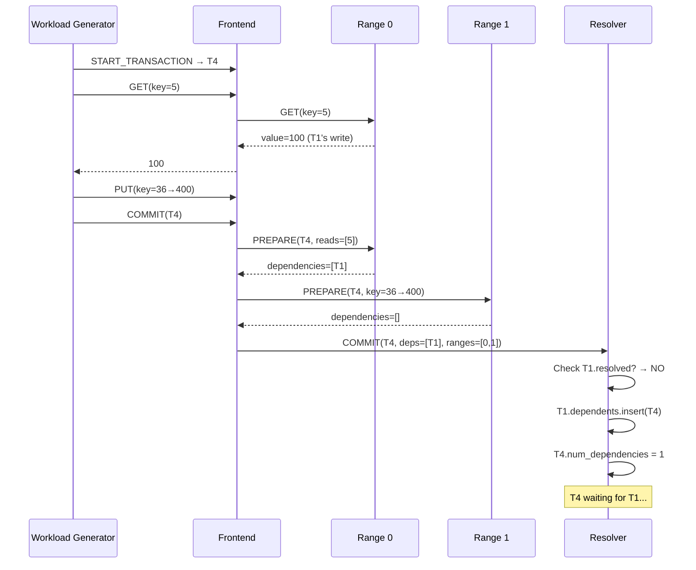

**Resolver State After T4 Registers:**
```mermaid
graph TB
    subgraph Resolver.State
        IPT["info_per_transaction:<br/>{<br/>  T1: {<br/>    num_dependencies: 0,<br/>    dependents: {T2, T4},  ← UPDATED<br/>    ranges: [0, 1]<br/>  },<br/>  T2: {<br/>    num_dependencies: 1,<br/>    dependents: {},<br/>    ranges: [0]<br/>  },<br/>  T4: {<br/>    num_dependencies: 1,  ← Must wait for T1<br/>    dependents: {},<br/>    ranges: [0, 1]<br/>  }<br/>}"]
        RT[resolved_transactions: {}]
        CT[committed_transactions: {}]
    end

    subgraph Resolver.waiting_transactions
        WT["waiting_transactions:<br/>{<br/>  T1: oneshot_sender,<br/>  T2: oneshot_sender,<br/>  T4: oneshot_sender<br/>}"]
    end
```

**Dependency Graph So Far:**
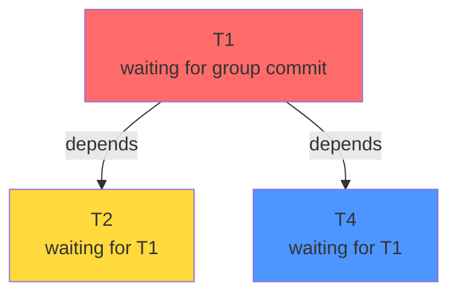

---

### Step 4: T3 Executes and Prepares

**Timeline:**
1. T3 reads key=5 from Range 0 → sees T2's write (value=300)
2. T3 writes: key=70 → value=500
3. Frontend sends PREPARE to Range 0 and Range 2
4. Range 0 returns dependency=[T2] (not T1 directly!)
5. Range 2 returns dependency=[]
6. Frontend calls Resolver.commit(T3, dependencies=[T2], ranges=[0,2])

**Sequence Diagram:**


**Resolver State After T3 Registers:**
```mermaid
graph TB
    subgraph Resolver.State
        IPT["info_per_transaction:<br/>{<br/>  T1: {<br/>    num_dependencies: 0,<br/>    dependents: {T2, T4},<br/>    ranges: [0, 1]<br/>  },<br/>  T2: {<br/>    num_dependencies: 1,<br/>    dependents: {T3},  ← UPDATED<br/>    ranges: [0]<br/>  },<br/>  T3: {<br/>    num_dependencies: 1,  ← Must wait for T2<br/>    dependents: {},<br/>    ranges: [0, 2]<br/>  },<br/>  T4: {<br/>    num_dependencies: 1,<br/>    dependents: {},<br/>    ranges: [0, 1]<br/>  }<br/>}"]
        RT[resolved_transactions: {}]
        CT[committed_transactions: {}]
    end

    subgraph Resolver.waiting_transactions
        WT["waiting_transactions:<br/>{<br/>  T1: oneshot_sender,<br/>  T2: oneshot_sender,<br/>  T3: oneshot_sender,<br/>  T4: oneshot_sender<br/>}"]
    end
```

**Complete Dependency Graph:**
```mermaid
graph TD
    T1[T1<br/>num_dependencies: 0<br/>dependents: {T2, T4}]
    T2[T2<br/>num_dependencies: 1<br/>dependents: {T3}]
    T3[T3<br/>num_dependencies: 1<br/>dependents: {}]
    T4[T4<br/>num_dependencies: 1<br/>dependents: {}]

    T1 -->|T2 depends on T1| T2
    T1 -->|T4 depends on T1| T4
    T2 -->|T3 depends on T2| T3

    style T1 fill:#ff6b6b
    style T2 fill:#ffd93d
    style T3 fill:#6bcf7f
    style T4 fill:#4d96ff
```

**Key Insight**: T3 only knows it depends on T2, not T1. But through transitive closure, T3 will be aborted when T1 aborts.

---

### Step 5: T1 ABORTS

**Timeline:**
1. Range Server detects abort condition (artificial abort rate trigger OR real conflict)
2. Frontend calls Resolver.abort(T1)
3. Resolver performs BFS graph traversal to find all dependents
4. Resolver marks all as aborted and notifies clients

**Abort Detection:**
```rust
// In range server during PREPARE:
if rand::random::<f64>() < artificial_abort_rate {
    return Err(PrepareError::ArtificialAbort);
}
```

**Sequence Diagram:**
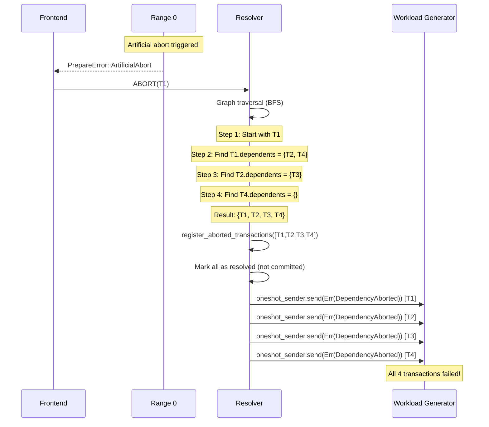

**Graph Traversal Code (resolver.rs:275-305):**
```rust
pub async fn abort(resolver: Arc<Self>, transaction_id: Uuid) -> Result<(), Error> {
    let mut transactions_to_abort = HashSet::new();
    transactions_to_abort.insert(T1);  // Start: {T1}

    {
        let state = resolver.state.read().await;
        let mut to_explore = vec![T1];

        while let Some(tx_id) = to_explore.pop() {
            if let Some(tx_info) = state.info_per_transaction.get(&tx_id) {
                for dependent in &tx_info.dependents {
                    if transactions_to_abort.insert(*dependent) {
                        to_explore.push(*dependent);  // Add for exploration
                    }
                }
            }
        }
    }

    // Iteration 1: tx_id=T1 → finds {T2, T4}
    //   transactions_to_abort = {T1, T2, T4}
    //   to_explore = [T4, T2]

    // Iteration 2: tx_id=T4 → finds {}
    //   to_explore = [T2]

    // Iteration 3: tx_id=T2 → finds {T3}
    //   transactions_to_abort = {T1, T2, T3, T4}
    //   to_explore = [T3]

    // Iteration 4: tx_id=T3 → finds {}
    //   to_explore = []

    // DONE: transactions_to_abort = {T1, T2, T3, T4}

    Self::register_aborted_transactions(resolver,
        transactions_to_abort.into_iter().collect()).await
}
```

**Console Output:**
```
Aborting transaction T1 and cascading to dependents
Cascading abort to dependent transaction T2
Cascading abort to dependent transaction T4
Cascading abort to dependent transaction T3
Collected 4 transactions to abort (including dependents)
```

---

### Step 6: Register Aborted Transactions

**Timeline:**
1. Mark all transactions as "resolved" (fate decided)
2. Do NOT add to "committed" set
3. Remove oneshot senders from waiting_transactions
4. Send error notifications to all clients

**Code (resolver.rs:307-357):**
```rust
pub async fn register_aborted_transactions(
    resolver: Arc<Self>,
    transaction_ids: Vec<Uuid>,  // [T1, T2, T3, T4]
) -> Result<(), Error> {
    {
        let mut state = resolver.state.write().await;

        // Mark as resolved (fate decided) but NOT committed
        for transaction_id in &transaction_ids {
            state.resolved_transactions.insert(*transaction_id);
            // DO NOT add to committed_transactions!
        }

        // Notify waiting clients with error
        let mut waiting_transactions = resolver.waiting_transactions.write().await;
        for transaction_id in &transaction_ids {
            if let Some(sender) = waiting_transactions.remove(transaction_id) {
                let _ = sender.send(Err(Error::TransactionAborted(
                    TransactionAbortReason::DependencyAborted
                )));
            }
        }
    }
    Ok(())
}
```

**Final Resolver State:**
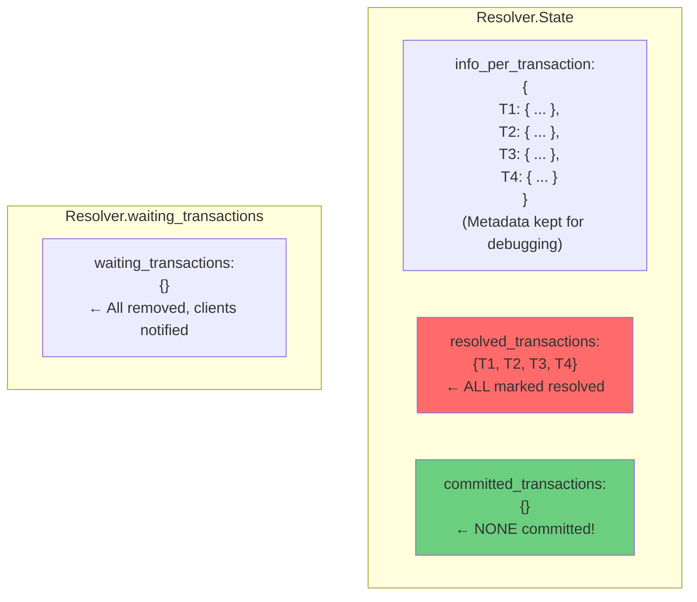

**Console Output:**
```
Registering 4 transactions as aborted
Transaction T1 marked as resolved (aborted)
Transaction T2 marked as resolved (aborted)
Notified transaction T2 of abort
Transaction T3 marked as resolved (aborted)
Notified transaction T3 of abort
Transaction T4 marked as resolved (aborted)
Notified transaction T4 of abort
```

---

### Step 7: Client Receives Abort Notifications

**Timeline:**
1. Each client's commit() call awaits on oneshot receiver
2. Resolver sends Err(TransactionAborted(DependencyAborted))
3. Client propagates error up the stack
4. Workload generator counts transaction as failed (not committed)

**Client Code (rw_transaction.rs:127-134):**
```rust
client_clone
    .commit(CommitRequest {
        transaction_id: transaction_id.to_string(),
    })
    .await
    .map_err(|e| FrontendError::InternalError(Arc::new(e)))?;
    // ↑ Returns Err, propagated with ?
    // Transaction NOT counted in throughput metrics
```

**Result:**
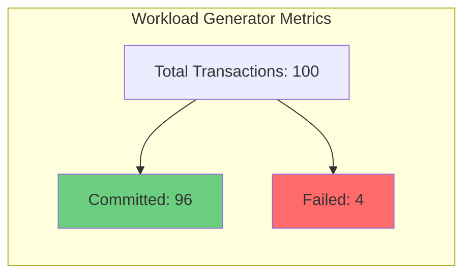

---

## Key Concepts Visualized

### The Two-Set Design

Why have both `resolved_transactions` and `committed_transactions`?

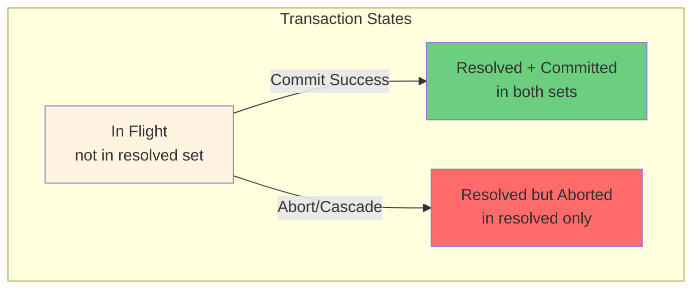

**When new transaction T5 arrives with dependency on T1:**
```rust
for dependency in dependencies {  // dependency = T1
    if !state.resolved_transactions.contains(&T1) {
        // T1's fate unknown → T5 must wait
        num_pending_dependencies += 1;
    } else {
        // T1's fate decided (committed or aborted)
        if state.committed_transactions.contains(&T1) {
            // T1 committed → T5 can proceed safely
        } else {
            // T1 aborted → T5 will be cascaded
        }
    }
}
```

### The Critical Time Window

Why can T2 read T1's write before T1 commits?

```mermaid
gantt
    title Pipelined 2PC: The Dangerous Window
    dateFormat SSS
    axisFormat %L ms

    section T1 Lifecycle
    T1 Execute     :t1exec, 000, 050
    T1 PREPARE     :t1prep, 050, 070
    Lock Released  :milestone, 070, 0
    Writes Visible :milestone, 070, 0
    T1 Group Commit:t1commit, 100, 120

    section T2 Lifecycle
    T2 Execute     :t2exec, 075, 090
    T2 Reads T1    :crit, 075, 080
    T2 PREPARE     :t2prep, 090, 100
    T2 Waiting     :t2wait, 100, 140

    section Abort Window
    Dangerous Window :crit, 070, 120
```

**Key Points:**
- At time 70ms: T1 releases locks, writes become visible
- At time 75-80ms: T2 reads T1's uncommitted write
- At time 100-120ms: T1 decides to commit (or abort)
- **If T1 aborts**: T2 read dirty data → must abort

### Forward vs Reverse Edges

The resolver maintains both forward and reverse dependency edges:

```mermaid
graph LR
    subgraph "Forward Edges (num_dependencies)"
        T2F[T2: num_dependencies=1]
        T3F[T3: num_dependencies=1]
        T4F[T4: num_dependencies=1]
    end

    subgraph "Transaction T1"
        T1[T1]
    end

    subgraph "Reverse Edges (dependents)"
        T1R[T1: dependents={T2, T4}]
        T2R[T2: dependents={T3}]
    end

    T2F -.->|waits for| T1
    T3F -.->|waits for| T2R
    T4F -.->|waits for| T1

    T1R -->|cascade to| T2R
    T1R -->|cascade to| T4F
    T2R -->|cascade to| T3F

    style T1R fill:#ff6b6b
    style T2R fill:#ffd93d
```

**Why both?**
- **Forward edges** (`num_dependencies`): Used to block transaction until dependencies resolve
- **Reverse edges** (`dependents`): Used for cascading aborts via BFS traversal

## Performance Impact

### Cascading Abort Amplification

When abort rate increases, cascading effects amplify:

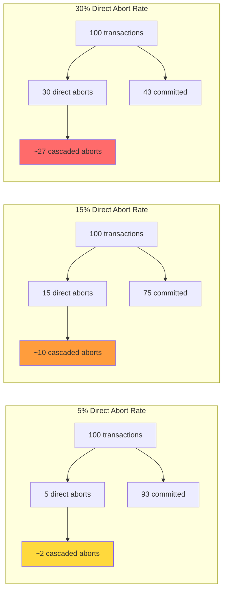

**Experimental Results:**
- 5% abort rate → 509.6 txn/s committed
- 15% abort rate → 349.1 txn/s committed (-31.5%)
- 30% abort rate → 213.3 txn/s committed (-58.1%)

### Why High Contention Creates More Cascading

With Zipfian distribution (zipf=0.9), popular keys are accessed frequently:

```mermaid
graph TD
    subgraph "Hot Key: key=5 (Zipfian zipf=0.9)"
        K5[key=5<br/>Accessed by 40% of transactions]
    end

    T1[T1] -->|writes| K5
    T2[T2] -->|reads| K5
    T3[T3] -->|reads| K5
    T4[T4] -->|reads| K5
    T5[T5] -->|reads| K5
    T6[T6] -->|reads| K5

    K5 -.->|depends| T2
    K5 -.->|depends| T3
    K5 -.->|depends| T4
    K5 -.->|depends| T5
    K5 -.->|depends| T6

    style T1 fill:#ff6b6b
    style K5 fill:#ffd93d
```

**Result**: One abort on a hot key cascades to many dependent transactions.

## Summary

### Data Flow

```mermaid
flowchart TD
    START[Transaction Start] --> EXECUTE[Execute Reads/Writes]
    EXECUTE --> PREPARE[PREPARE Phase]
    PREPARE --> LOCK_RELEASE[Release Locks<br/>Pipelined 2PC]
    LOCK_RELEASE --> VISIBLE[Writes Visible to Others]
    VISIBLE --> REGISTER[Register with Resolver]

    REGISTER --> CHECK_DEPS{Dependencies<br/>Resolved?}
    CHECK_DEPS -->|Yes, All Committed| COMMIT_QUEUE[Queue for Group Commit]
    CHECK_DEPS -->|No| WAIT[Wait on Oneshot Channel]

    PREPARE --> ABORT_CHECK{Abort?}
    ABORT_CHECK -->|Yes| ABORT[Resolver.abort]
    ABORT -->|BFS Traversal| FIND_DEPS[Find All Dependents]
    FIND_DEPS --> MARK_ABORTED[Mark All as Resolved<br/>NOT Committed]
    MARK_ABORTED --> NOTIFY_ABORT[Notify Clients with Error]

    COMMIT_QUEUE --> COMMIT_SUCCESS[Group Commit]
    COMMIT_SUCCESS --> NOTIFY_COMMIT[Notify Clients with Success]

    WAIT --> RECV{Oneshot<br/>Receives?}
    RECV -->|Ok| COMMIT_QUEUE
    RECV -->|Err| NOTIFY_ABORT

    NOTIFY_COMMIT --> END_SUCCESS[Transaction Committed]
    NOTIFY_ABORT --> END_FAILURE[Transaction Aborted]

    style ABORT fill:#ff6b6b
    style FIND_DEPS fill:#ff6b6b
    style MARK_ABORTED fill:#ff6b6b
    style NOTIFY_ABORT fill:#ff6b6b
    style END_FAILURE fill:#ff6b6b

    style COMMIT_SUCCESS fill:#6bcf7f
    style NOTIFY_COMMIT fill:#6bcf7f
    style END_SUCCESS fill:#6bcf7f

    style LOCK_RELEASE fill:#ffd93d
    style VISIBLE fill:#ffd93d
```

### Key Takeaways

1. **Pipelined 2PC creates a dangerous window** where writes are visible before commit
2. **Dependencies are tracked bidirectionally**: forward (for blocking) and reverse (for cascading)
3. **BFS graph traversal** finds all transitive dependents when an abort occurs
4. **Two-set design** distinguishes between "fate decided" (resolved) and "successfully committed"
5. **Oneshot channels** provide efficient notification mechanism for waiting transactions
6. **High contention amplifies cascading** because more transactions depend on hot keys
7. **Throughput degrades non-linearly** with abort rate due to cascading amplification

## References

**Key Implementation Files:**
- `resolver/src/core/resolver.rs:275-357` - Cascading abort logic
- `resolver/src/core/resolver.rs:67-152` - Dependency registration
- `workload-generator/src/transaction_impl/rw_transaction.rs:127-134` - Client error handling
- `workload-generator/scripts/atomix_setup.py` - System configuration

**Testing:**
```bash
# Run cascading abort experiment
python3 workload-generator/scripts/cascading_abort_experiment.py

# View results
python3 experiment_results/parse_results.py
python3 experiment_results/plot_cascading_aborts.py
```
